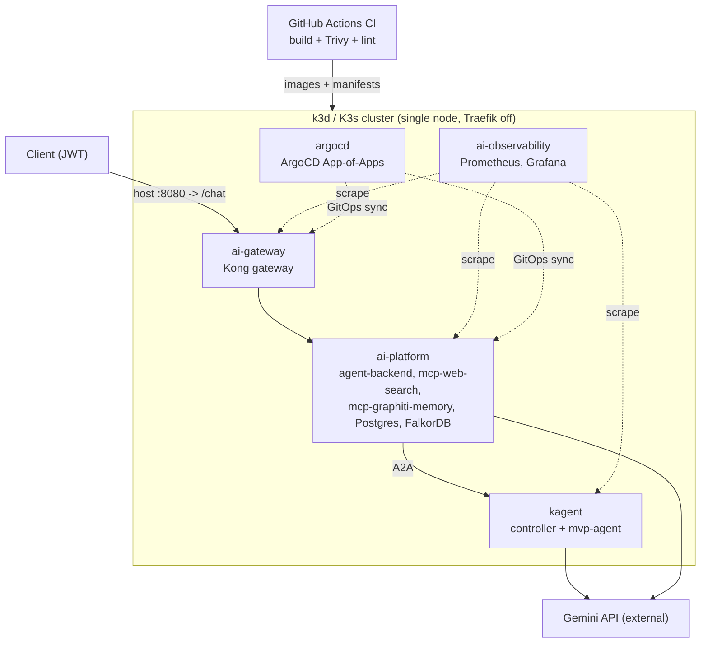
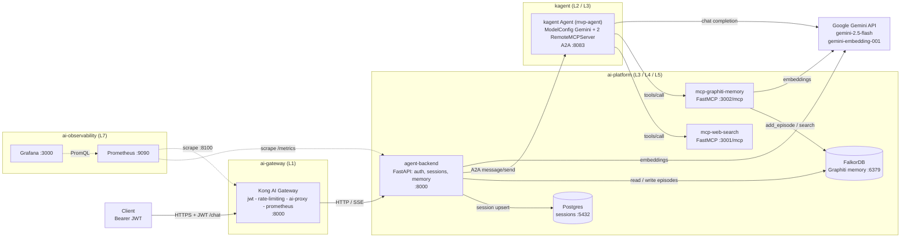

# infra-code - kagent-on-K3s agent MVP

A working, production-grade **MVP prototype**: a Gemini-powered agent running on a **kagent** runtime on
**k3d / K3s**, fronted by **Kong** (JWT auth + Gemini egress), with **two MCP tools** (web-search +
graphiti-memory), **session memory** in **Graphiti-on-FalkorDB**, **session IDs** in **Postgres**,
**Prometheus + Grafana** observability, a **golden-set eval**, and **ArgoCD** GitOps + GitHub Actions CI.

> Read [`SPEC.md`](SPEC.md) for the full build contract (namespaces, DNS, ports, secrets, auth) and the
> tracked deviations from the parent platform. The staff-grade production-readiness audit is in
> [`docs/PRODUCTION-READINESS.md`](docs/PRODUCTION-READINESS.md).

## Architecture

### Infrastructure topology (high-level)



### Request flow



The request pipeline: **Client -> Kong (JWT) -> agent-backend** (re-verify JWT, upsert session in
Postgres, load memory from Graphiti/FalkorDB) **-> A2A -> kagent Agent** (Gemini reasoning + the two MCP
tools) **-> response streamed back as SSE**. Memory is written back to FalkorDB as Graphiti episodes.
Prometheus scrapes metrics; Grafana visualizes them.

## Technical stack

| Layer | Component | Technology | Namespace | Port |
|---|---|---|---|---|
| L1 Gateway | Kong AI Gateway | Kong OSS 3.9 (DB-less, declarative) | `ai-gateway` | 8000 proxy / 8100 status |
| L2/L3 Runtime | kagent Agent | kagent v1alpha2 (Python ADK) | `kagent` | 8083 (A2A) |
| L3 Backend | agent-backend | FastAPI + asyncpg + Graphiti + httpx (Python 3.12) | `ai-platform` | 8000 |
| L5 Tool | mcp-web-search | MCP Python SDK (FastMCP, ddgs) | `ai-platform` | 3001 |
| L5 Tool | mcp-graphiti-memory | FastMCP + graphiti-core | `ai-platform` | 3002 |
| L4 Memory | FalkorDB | FalkorDB v4.2.2 (Graphiti graph backend) | `ai-platform` | 6379 |
| L4 Sessions | Postgres | postgres 16 | `ai-platform` | 5432 |
| L7 Metrics | Prometheus | prom/prometheus v2.54 | `ai-observability` | 9090 |
| L7 Dashboards | Grafana | grafana 11 | `ai-observability` | 3000 |
| LLM | Gemini | google-genai (gemini-2.5-flash + gemini-embedding-001) | external | 443 |
| GitOps / CI | ArgoCD + GitHub Actions | App-of-Apps, Trivy, kubeconform | `argocd` | - |
| Cluster | K3s via k3d | single-node, Traefik disabled | - | host 8080 -> 80 |

Auth: per-app JWT (HS256, `iss=mvp-app`) validated at Kong and re-verified in agent-backend. Secrets are
K8s Secrets created from `.env/.env.infra` at stand-up. Every workload runs non-root with a read-only root
filesystem, dropped capabilities, and default-deny NetworkPolicies with explicit allow-edges.

## Run it locally (the supported path)

`make mvp-up-direct` creates a k3d cluster, builds and imports the 3 service images, creates the K8s
Secrets from your `.env`, applies every layer in wave order, installs the kagent control plane and the
Kong proxy via Helm, applies the kagent NetworkPolicy, and renders the Kong declarative config.

### 1. Prerequisites

Install and have on PATH: `docker`, `k3d`, `kubectl`, `helm`, `helmfile`, and `envsubst` (the `gettext`
package). You also need a **Google Gemini API key** (https://aistudio.google.com/apikey).

```bash
docker --version && k3d version && kubectl version --client \
  && helm version && helmfile --version && envsubst --version
```

### 2. Set the one required secret

`.env/.env.infra` is already populated with local dev values for `JWT_SECRET`, `POSTGRES_PASSWORD`, and
`FALKORDB_PASSWORD`. The only blank is your Gemini key. Edit the file and set it:

```
GOOGLE_API_KEY=AIza...your-key...
```

(`.env/` is gitignored, so this is never committed. `make` refuses to start if the key is empty.)

### 3. Bring up the cluster

```bash
cd infra-code
make mvp-up-direct
```

### 4. Wait for the workloads to be Ready

```bash
kubectl get pods -A                                            # watch until all are Running/Ready
kubectl -n ai-platform rollout status statefulset/postgres
kubectl -n ai-platform rollout status statefulset/falkordb
kubectl -n ai-platform rollout status deploy/mcp-web-search
kubectl -n ai-platform rollout status deploy/mcp-graphiti-memory
kubectl -n ai-platform rollout status deploy/agent-backend
kubectl -n kagent     get deploy   # then rollout status the kagent controller deploy
kubectl -n ai-gateway get deploy   # then rollout status the kong deploy
```

### 5. Smoke-test and eval

```bash
make smoke    # mints a JWT, POSTs /chat through Kong at localhost:8080, prints the SSE answer
make eval     # runs the golden-set Gemini LLM-as-judge over /chat
```

### 6. Tear down

```bash
make mvp-down   # deletes the k3d cluster
```

### Useful targets

```bash
make help       # list all targets
make token      # mint a short-lived HS256 JWT (iss=mvp-app)
make secrets    # (re)create the K8s Secrets from .env
make lint       # ruff + kustomize build + kubeconform (best-effort)
```

## Health checks (per layer and pipeline)

Run these after `make mvp-up-direct` to confirm each layer and the end-to-end pipeline are healthy. The
HTTP checks use `kubectl port-forward` in the background (kill them with `kill %1` etc. when done).

```bash
# --- Cluster ---
kubectl get nodes
kubectl get pods -A                                # everything Running/Ready

# --- L3 agent-backend: liveness + dependency readiness ---
kubectl -n ai-platform port-forward deploy/agent-backend 8000:8000 >/dev/null 2>&1 &
curl -s localhost:8000/healthz ; echo              # liveness
curl -s -o /dev/null -w '%{http_code}\n' localhost:8000/readyz   # 200 = PG+FalkorDB+A2A healthy, 503 = degraded
curl -s localhost:8000/metrics | grep agent_backend_ | head      # RED metrics present

# --- L4 stores ---
kubectl -n ai-platform exec statefulset/postgres  -- pg_isready -U agent -d agentmvp      # accepting connections
kubectl -n ai-platform exec statefulset/falkordb  -- redis-cli ping                       # PONG

# --- L5 MCP tools (TCP-only; FastMCP exposes /mcp, no /metrics or /healthz) ---
kubectl -n ai-platform get pods -l app=mcp-web-search
kubectl -n ai-platform get pods -l app=mcp-graphiti-memory

# --- L2/L3 kagent control plane + CRs ---
kubectl -n kagent get pods
kubectl -n kagent get agents.kagent.dev modelconfigs.kagent.dev remotemcpservers.kagent.dev

# --- L1 Kong gateway status ---
KONG=$(kubectl -n ai-gateway get deploy -o name | head -1)
kubectl -n ai-gateway port-forward "$KONG" 8100:8100 >/dev/null 2>&1 &
curl -s localhost:8100/status                      # database/server stats

# --- L7 observability ---
kubectl -n ai-observability port-forward deploy/prometheus 9090:9090 >/dev/null 2>&1 &
curl -s 'localhost:9090/api/v1/targets?state=active' | grep -o '"health":"[a-z]*"' | sort | uniq -c   # all "up"
kubectl -n ai-observability port-forward deploy/grafana 3000:3000 >/dev/null 2>&1 &
curl -s localhost:3000/api/health                  # {"database":"ok",...}

# --- End-to-end pipeline (the real check) ---
make smoke                                          # full chat path through every hop
make eval                                           # memory + reasoning quality over the golden set
```

What each confirms:

- **agent-backend `/readyz`** is the single best health signal: it returns 503 unless Postgres, FalkorDB,
  and the A2A circuit breaker to kagent are all healthy.
- **`pg_isready` / `redis-cli ping`** confirm the L4 data plane (session store + memory graph) is up.
- **Prometheus targets all `up`** confirms the metrics pipeline is wired (agent-backend, Kong, kagent).
- **`make smoke`** is the integration proof: a JWT flows through Kong, the backend, A2A to the kagent
  Agent, Gemini, and the MCP tools, and an SSE answer comes back. **`make eval`** additionally exercises
  the memory-recall pipeline (Graphiti episodes in FalkorDB).

## Layout

```
infra-code/
  SPEC.md                       build contract (source of truth)
  docs/PRODUCTION-READINESS.md  staff-grade audit + remediation register
  Makefile                      mvp-up-direct/down, build-images, secrets, token, smoke, eval
  .env/.env.infra               all infra variables (gitignored; set GOOGLE_API_KEY)
  cluster/k3d/                  k3d cluster config (host 8080 -> 80, Traefik off)
  platform/
    foundation/                 namespaces + default-deny NetworkPolicies + secret templates
    argocd/                     App-of-Apps root + project + applications/ (GitOps path)
    kong/                       Kong OSS gateway: helmfile + values + declarative config + NetworkPolicy
    data/                       FalkorDB + Postgres (+ sessions schema)
    kagent/                     kagent helmfile + ModelConfig(Gemini) + Agent + 2x RemoteMCPServer + NetworkPolicy
    observability/              Prometheus + Grafana + dashboard
  services/
    agent-backend/              FastAPI: auth, sessions, Graphiti memory, A2A -> kagent Agent
    mcp-web-search/             MCP server (STREAMABLE_HTTP, :3001)
    mcp-graphiti-memory/        MCP server wrapping Graphiti/FalkorDB (:3002)
  eval/                         golden set + Gemini LLM-as-judge
  .github/workflows/            CI: build 3 images, Trivy scan, helm/kustomize/kubeconform lint
```

## Notes

- Use **`make mvp-up-direct`** locally. `make mvp-up` is the GitOps path (ArgoCD App-of-Apps) and
  additionally needs this repo pushed to a reachable remote plus Helm Applications for kagent/Kong
  (SPEC §19). The local path has no git or remote dependency.
- **Pin the kagent chart** before a clean run: the helmfile floor is a placeholder; resolve the real
  published patch with `helm show chart oci://ghcr.io/kagent-dev/kagent/helm/kagent` and set
  `CHART_VERSION` (and `KONG_CHART_VERSION` if needed).
- This is a deliberate MVP slice of the full platform. Deviations (Prometheus instead of Alloy/LGTM-P,
  OSS Kong plugins, no CubeSandbox/OPA/HA, Gemini embedder instead of self-hosted bge, etc.) and the
  applied run-blocker fixes are tracked in [`SPEC.md`](SPEC.md) §15-19.
