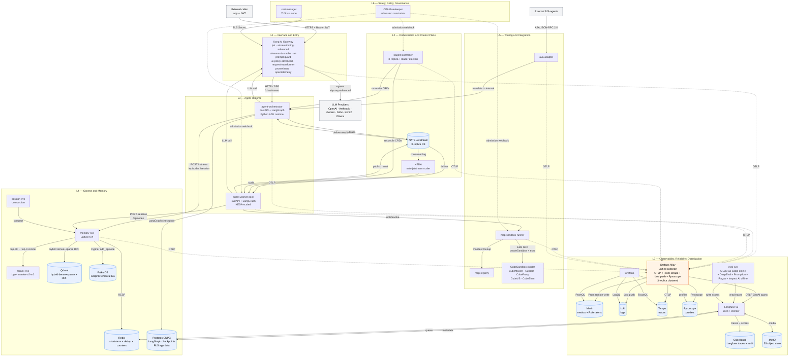

# Infra-ai-Agentic-systems

A production-grade AI infrastructure platform for hosting agentic workloads on Kubernetes (K3s locally via k3d; K3s on EC2 in AWS — there is no EKS option per ADR-0010), built as a deliberate extension of the CNCF **kagent** project with the addition of Kong AI Gateway, CubeSandbox, Graphiti-on-FalkorDB temporal knowledge graph memory, a multi-LLM provider router via Kong, and a Langfuse-integrated evaluation pipeline.

This repository contains the **infrastructure platform**, not an agentic application. Agentic workloads are deployed onto the platform as standard Kubernetes resources (kagent CRDs). A reference workload, ported from the [Fareed Khan production-grade-agentic-system](https://github.com/FareedKhan-dev/production-grade-agentic-system) repository that backs the [seven-layer model article](https://levelup.gitconnected.com/building-the-7-layers-of-a-production-grade-agentic-ai-system-37ee5d941f1c), is used to validate the platform end to end.

## Full infrastructure diagram

The whole platform on one canvas. Every component below is owned by exactly one of the seven layers; every edge is labeled with its protocol.


```mermaid
flowchart TB
    %% External world
    CLIENT[External caller<br/>app + JWT]
    PEER[External A2A agents]
    LLM_EXT[LLM Providers<br/>OpenAI · Anthropic · Gemini · GLM · Kimi 2 · Ollama]

    %% L1
    subgraph L1[L1 — Interface and Entry]
        KONG[Kong AI Gateway<br/>jwt · ai-rate-limiting-advanced<br/>ai-semantic-cache · ai-prompt-guard<br/>ai-proxy-advanced · request-transformer<br/>prometheus · opentelemetry]
    end

    %% L2
    subgraph L2[L2 — Orchestration and Control Plane]
        NATS[(NATS JetStream<br/>3-replica R3)]
        KEDA[KEDA<br/>nats-jetstream scaler]
        KCTRL[kagent controller<br/>3-replica + leader election]
    end

    %% L3
    subgraph L3[L3 — Agent Runtime]
        ORCH[agent-orchestrator<br/>FastAPI + LangGraph<br/>Python ADK runtime]
        WRK[agent-worker pool<br/>FastAPI + LangGraph<br/>KEDA-scaled]
    end

    %% L4
    subgraph L4[L4 — Context and Memory]
        MS[memory-svc<br/>unified API]
        SS[session-svc<br/>compaction]
        RR[rerank-svc<br/>bge-reranker-v2-m3]
        QDRANT[(Qdrant<br/>hybrid dense+sparse + RRF)]
        FDB[(FalkorDB<br/>Graphiti temporal KG)]
        REDIS[(Redis<br/>short-term + dedup + counters)]
        PG[(Postgres CNPG<br/>LangGraph checkpoints<br/>RLS app data)]
    end

    %% L5
    subgraph L5[L5 — Tooling and Integration]
        REG[mcp-registry]
        MSR[mcp-sandbox-runner]
        A2A[a2a-adapter]
        CUBE[CubeSandbox cluster<br/>CubeMaster · Cubelet · CubeProxy<br/>CubeVS · CubeShim]
    end

    %% L6
    subgraph L6[L6 — Safety, Policy, Governance]
        OPA[OPA Gatekeeper<br/>admission constraints]
        CERTMGR[cert-manager<br/>TLS issuance]
    end

    %% L7
    subgraph L7[L7 — Observability, Reliability, Optimization]
        ALLOY[Grafana Alloy<br/>unified collector<br/>OTLP + Prom scrape + Loki push + Pyroscope<br/>3-replica clustered]
        MIMIR[(Mimir<br/>metrics + Ruler alerts)]
        LOKI[(Loki<br/>logs)]
        TEMPO[(Tempo<br/>traces)]
        PYR[(Pyroscope<br/>profiles)]
        GRAF[Grafana]
        LFW[Langfuse v3<br/>Web + Worker]
        CH[(ClickHouse<br/>Langfuse traces + audit)]
        MINIO[(MinIO<br/>S3 object store)]
        EVS[eval-svc<br/>5 LLM-as-judge online<br/>+ DeepEval + Promptfoo + Ragas + Inspect AI offline]
    end

    %% Inbound
    CLIENT -->|HTTPS + Bearer JWT| KONG
    PEER -->|A2A JSON-RPC 2.0| A2A

    %% L1 → L3
    KONG -->|"HTTP / SSE<br/>/chat/stream"| ORCH
    KONG -->|"egress<br/>ai-proxy-advanced"| LLM_EXT
    A2A -->|translate to internal| ORCH

    %% L3 ↔ L2
    ORCH -->|publish subtask| NATS
    NATS -->|deliver| WRK
    WRK -->|publish result| NATS
    NATS -->|deliver result| ORCH
    NATS -.->|consumer lag| KEDA
    KEDA -->|scale| WRK
    KCTRL -->|reconcile CRDs| ORCH
    KCTRL -->|reconcile CRDs| WRK

    %% L3 → L4
    ORCH -->|"POST /retrieve<br/>/episodes /session"| MS
    WRK -->|"POST /retrieve<br/>/episodes"| MS
    MS -->|"top-50 → top-K rerank"| RR
    MS -->|hybrid dense+sparse RRF| QDRANT
    MS -->|Cypher add_episode| FDB
    MS -->|RESP| REDIS
    ORCH -->|LangGraph checkpoint| PG
    SS -->|compact| MS

    %% L3 → L5 → CubeSandbox
    WRK -->|tools/invoke| MSR
    MSR -->|manifest lookup| REG
    MSR -->|"E2B SDK<br/>createSandbox + exec"| CUBE

    %% LLM egress through Kong
    ORCH -->|LLM call| KONG
    WRK -->|LLM call| KONG

    %% L6 enforcement
    OPA -.->|admission webhook| KCTRL
    OPA -.->|admission webhook| WRK
    OPA -.->|admission webhook| MSR
    CERTMGR -->|TLS Secret| KONG

    %% L7 ingest (every service emits OTLP)
    KONG -.->|OTLP| ALLOY
    ORCH -.->|OTLP| ALLOY
    WRK -.->|OTLP| ALLOY
    MS -.->|OTLP| ALLOY
    MSR -.->|OTLP| ALLOY
    A2A -.->|OTLP| ALLOY
    KCTRL -.->|OTLP| ALLOY

    %% L7 fan-out
    ALLOY -->|Prom remote-write| MIMIR
    ALLOY -->|Loki push| LOKI
    ALLOY -->|OTLP| TEMPO
    ALLOY -->|Pyroscope| PYR
    ALLOY -->|OTLP GenAI spans| LFW

    %% Grafana visualization
    GRAF -->|PromQL| MIMIR
    GRAF -->|LogQL| LOKI
    GRAF -->|TraceQL| TEMPO
    GRAF -->|profiles| PYR

    %% Langfuse data plane
    LFW -->|traces + scores| CH
    LFW -->|metadata| PG
    LFW <-->|queue| REDIS
    LFW <-->|media| MINIO

    %% Eval closure
    EVS -->|read traces| LFW
    EVS -->|write scores| LFW

    %% Styling
    classDef store fill:#e8f0fe,stroke:#1a73e8,color:#000
    classDef alloy fill:#fff4e6,stroke:#e8590c,color:#000
    classDef external fill:#f3f4f6,stroke:#6b7280,color:#000
    class QDRANT,FDB,REDIS,PG,MIMIR,LOKI,TEMPO,PYR,CH,MINIO,NATS store
    class ALLOY alloy
    class CLIENT,PEER,LLM_EXT external
```

## Architectural spine: the seven layers

Every component above maps to exactly one layer. The table below is the canonical row-by-row contract for what each layer delivers and which doctrine documents apply to it.

| # | Layer | What this platform delivers | Doctrines |
|---|---|---|---|
| L1 | Interface and Entry | Kong AI Gateway — JWT per app, semantic cache, token-aware AI rate limiting, input sanitization, `ai-proxy-advanced` cross-provider LLM routing with failover and circuit breaking | — |
| L2 | Orchestration and Control Plane | NATS JetStream message bus (R3), kagent reasoning loop, LangGraph state machine, KEDA autoscaler on consumer lag | heuristic-engineering |
| L3 | Agent Runtime | kagent CRDs (3-replica controller + leader election), `agent-orchestrator` and `agent-worker` services, A2A adapter, per-app namespace isolation, **Python ADK runtime only** (ADR-0011) | context-engineering · heuristic-engineering |
| L4 | Context and Memory | `memory-svc` over Graphiti-on-FalkorDB (temporal graph) + Qdrant (hybrid dense+sparse with RRF) + Redis (short-term) + Postgres (LangGraph checkpoints); `rerank-svc` (bge-reranker-v2-m3 only); `session-svc` compaction | rag-architecture · context-engineering |
| L5 | Tooling and Integration | `mcp-registry`, `mcp-sandbox-runner`, **CubeSandbox cluster only** (sub-60 ms cold start), three reference MCP tools, A2A interop | — |
| L6 | Safety, Policy and Governance | OPA Gatekeeper at K8s admission, Kong AI guardrails at perimeter, Alloy OTTL redaction at telemetry egress, ClickHouse audit trail, RBAC at every plane | testing-strategy |
| L7 | Observability, Reliability and Optimization | **Grafana Alloy** as the unified collector (replaces vanilla OTel Collector + kube-prometheus-stack + Promtail + standalone profiling agent); LGTM-P backends (Loki, Grafana, Tempo, Mimir, Pyroscope); Langfuse v3 self-hosted; `eval-svc` with four-tool harness composition | harness-engineering · testing-strategy |

## Five cross-cutting doctrines

The five engineering disciplines that govern *how* the platform behaves, cross-layer:

- **[Context engineering](docs/protocols/context-engineering.md)** — Selection / Retrieval / Compression / Persistence of what enters the model's context window.
- **[Heuristic engineering](docs/protocols/heuristic-engineering.md)** — codified, observable decision rules in the orchestrator and worker.
- **[RAG architecture](docs/protocols/rag-architecture.md)** — hybrid search with RRF, reranking, semantic chunking, RAGAS gates.
- **[Harness engineering](docs/protocols/harness-engineering.md)** — the four-tool evaluation composition (DeepEval + Promptfoo + Ragas + Inspect AI) that gates CI.
- **[Testing strategy](docs/protocols/testing-strategy.md)** — per-component unit / integration / contract / load / chaos / E2E coverage.

## One stack per use case

The platform enforces this hard rule: exactly one technology choice per concern. Recorded in every relevant ADR.

| Concern | Choice | Decision |
|---|---|---|
| Cluster substrate | K3s only (k3d local, K3s-on-VM staging, K3s-on-EC2 AWS) — no EKS | ADR-0010 |
| Gateway | Kong AI Gateway — no kgateway parallel | ADR-0012 |
| Message bus | NATS JetStream — no Kafka, no Pulsar, no Redis Streams | ADR-0007 |
| Agent runtime | kagent Python ADK only — no Go ADK parallel | ADR-0011 |
| Vector store | Qdrant — no pgvector, no Weaviate, no Pinecone | ADR-0004 + RAG doctrine |
| Graph memory | Graphiti on FalkorDB — no Neo4j, no Kuzu, no Mem0 | ADR-0004 |
| Reranker | `bge-reranker-v2-m3` self-hosted — no Cohere, no Voyage | RAG doctrine |
| Embedding | `bge-large-en-v1.5` self-hosted — no OpenAI, no Voyage | RAG doctrine |
| Tool sandbox | CubeSandbox — no Kata, no gVisor, no E2B Cloud | ADR-0005 + ADR-0009 |
| Telemetry collector | Grafana Alloy — no vanilla OTel Collector, no kube-prometheus-stack, no Promtail | ADR-0006 |
| Admission policy | OPA Gatekeeper — no Kyverno parallel | ADR-0006 |
| TLS issuance | cert-manager — no parallel | — |
| CD | ArgoCD — no Flux parallel | ADR-0008 |
| CI | GitHub Actions — no Jenkins, no Tekton | ADR-0008 |

## Repository layout

```
docs/                                 Technical engineering documentation
  overview/                           Platform-wide orientation: README, principles, glossary, references
  layers/L1..L7-*/                    One folder per layer; README + FLOW.mmd
  adr/                                12 immutable, numbered architecture decision records
  stages/STAGE-NN-*/                  15 implementation stages
  protocols/                          MCP, A2A, OTel GenAI semconv + 5 doctrines
  reference/                          File-by-file lift from reference workload

platform/                             Infrastructure as code (Helm charts + ArgoCD apps)
  cluster/                            k3d-local + k3s-on-vm (no EKS — ADR-0010)
  argocd/                             App-of-Apps + Image Updater
  runtime-classes/                    RuntimeClass cube only
  namespaces/                         Default-deny NetworkPolicies
  kagent-base/                        kagent Helm values (Python ADK only)
  L1-gateway/kong/
  L2-orchestration/                   nats-jetstream, keda
  L4-data-plane/                      postgres, qdrant, falkordb, redis, clickhouse, minio
  L6-governance/                      opa-gatekeeper, cert-manager
  L7-observability/                   alloy, mimir, loki, tempo, pyroscope, langfuse, grafana-dashboards

services/                             Application services
  L3-agent-runtime/                   agent-orchestrator, agent-worker
  L4-context-and-memory/              memory-svc, session-svc, rerank-svc
  L5-tooling-integration/             mcp-registry, mcp-sandbox-runner, a2a-adapter
  L7-evaluation/eval-svc

shared/                               Schema-first contracts
  py-common/                          Logging, telemetry, middleware
  proto/                              OpenAPI, AsyncAPI, A2A AgentCard, MCP tool manifests

tools/                                MCP tool implementations (CubeSandbox templates)
  web-search, doc-search, code-exec

evals/                                Golden datasets, DeepEval suites, Promptfoo configs, Ragas suites, Inspect AI suites

infra-code/                           THE RUNNABLE IMPLEMENTATION (see infra-code/README.md)
  cluster/k3d/                        k3d cluster config with an enforced memory cap
  platform/
    foundation/                       namespaces, PriorityClasses, LimitRanges, ResourceQuotas, default-deny
    data/                             postgres, falkordb, minio
    kong/                             Kong AI Gateway values + declarative config + netpols
    kagent/                           lean chart values, ModelConfig, RemoteMCPServers, Agent CR
    observability/                    prometheus, grafana, loki, alloy, dashboards
    keda/                             chart values + ScaledObject + PDB
    langfuse/                         opt-in profile (requires ClickHouse)
    argocd/                           install overlay + AppProject + 14 Applications (6 sync waves)
  services/
    agent-backend/                    FastAPI + LangGraph; A2A client; PDF -> MinIO -> memory graph
    mcp-web-search/                   MCP tool server (DuckDuckGo, no API key)
    mcp-graphiti-memory/              MCP tool server (Graphiti-on-FalkorDB)
  scripts/                            verify.sh, smoke.sh, lint.sh, mint_token.py
  eval/                               golden set + Gemini LLM-as-judge runner

.github/workflows/                    CI for build/test/lint/scan; Image Updater bridge to ArgoCD
```

Note: `services/`, `shared/` and `tools/` above describe the *target* seven-layer platform and are
documentation-only today — their READMEs live under `backend-agent-docs/`. The code that actually
runs is `infra-code/`.

## Folder discipline

Every folder carries:

- `README.md` — purpose, contracts (upward and downward), service-level objectives, install/setup, embedded flow diagram, references.
- `FLOW.mmd` — Mermaid diagram of the data flow specific to that folder (where applicable).
- `runbook.md` — exact operational procedures (where applicable; added at the implementation stage).

A reader who lands in any subdirectory can orient themselves without leaving it.

## Quickstart

The runnable implementation lives in [`infra-code/`](infra-code/). Every target below delegates
there; see [`infra-code/README.md`](infra-code/README.md) for the full operator runbook.

```bash
make preflight          # tools + credentials + host RAM budget
make local-up           # k3d + ArgoCD + App-of-Apps (GitOps; needs a reachable remote)
make local-up-direct    # same platform, applied directly (no remote needed)
make verify             # health-check L1..L7, fails on the first break
make urls               # every UI endpoint
make smoke              # POST /chat and /chat/sync through Kong
make local-down         # tear down (PVC data survives)
```

### Prerequisites that actually bite

- **Container egress must work.** Check with `docker run --rm alpine:3.20 ping -c2 1.1.1.1`.
  If `/etc/docker/daemon.json` contains `"iptables": false`, Docker creates no NAT rules and *no*
  container reaches the network — the cluster cannot pull images and the agent cannot reach Gemini.
- **RAM.** ~6 GiB free for the core profile; ~11 GiB to add Langfuse (`make local-up-direct K3D_MEMORY=11g && make langfuse-up`).
- **CLIs:** `k3d kubectl helm kustomize argocd yq envsubst docker uv`.

### Deploying through the ArgoCD UI

`make local-up` installs ArgoCD and applies the App-of-Apps root, which fans out to 14 Applications
across six sync waves: foundation and KEDA (0) → data, Kong, observability, kagent-CRDs (1) →
kagent controller (2) → kagent CRs and both MCP servers (3) → agent-backend (4) → Agent CR and the
KEDA ScaledObject (5).

```bash
make argocd-ui          # prints URL + admin password
make argocd-login       # log the argocd CLI in
make argocd-status      # sync + health per Application, by wave
make argocd-sync        # force-sync everything and wait for Healthy
```

ArgoCD's repo-server clones over the network, so GitOps requires this repository to be pushed to the
`repoURL` in `infra-code/platform/argocd/root.yaml`. `make remote-check` verifies that precondition;
`make local-up-direct` is the offline path that needs no remote.

### Endpoints

| What | URL |
|---|---|
| Swagger UI (agent API) | http://localhost:8080/docs |
| Chat / PDF upload | `POST /chat/sync`, `POST /documents` on `:8080` |
| ArgoCD | http://localhost:8081 |
| Grafana | http://localhost:3000 |
| MinIO console | http://localhost:9001 |
| Langfuse | http://localhost:3001 (opt-in profile) |

## Status

**Stage 00 documentation contract** is complete: 12 immutable ADRs, 5 doctrines, 7-layer model.

**A runnable subset of the platform now exists under [`infra-code/`](infra-code/)** — k3d + ArgoCD
App-of-Apps, Kong AI Gateway, kagent control plane, Postgres + FalkorDB + MinIO, Prometheus +
Grafana + Loki + Alloy, KEDA, and a FastAPI agent-backend that runs a LangGraph turn over A2A with
checkpoints in FalkorDB and PDF ingestion into the memory graph. Langfuse is an opt-in profile.

It is **not** the full seven-layer platform. Still absent, and tracked in
[`infra-code/SPEC.md`](infra-code/SPEC.md) §20.5 and
[`.backlog/e2e-finalization-register.md`](.backlog/e2e-finalization-register.md): NATS JetStream,
Qdrant, `rerank-svc` (so reranking and the RAGAS gates are **unmet**), `memory-svc`/`session-svc`,
CubeSandbox and `RuntimeClass cube`, OPA Gatekeeper, cert-manager/TLS, Mimir, Tempo, Pyroscope,
Argo Rollouts, ArgoCD Image Updater, and the four-tool eval harness.

## License

Apache 2.0. See [LICENSE](LICENSE).

## References

See [`docs/overview/03-references.md`](docs/overview/03-references.md) for the full set of validated sources backing every decision in this repository.
