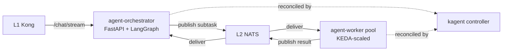

# L3 — Agent Runtime services

## Contents

| Service | Role |
|---|---|
| `agent-orchestrator/` | Lead-agent reference implementation; LangGraph state machine; orchestrator-worker dispatcher |
| `agent-worker/` | Subagent reference implementation; KEDA-autoscaled on NATS consumer lag |

Both services run on the kagent Python ADK runtime (the only runtime, per ADR-0011).

## References

- Layer specification: `docs/layers/L3-agent-runtime/README.md`.
- Decision rationale: `docs/adr/0011-base-platform-kagent.md`.
- Doctrines applied: `docs/protocols/context-engineering.md`, `docs/protocols/heuristic-engineering.md`.
- LangGraph: https://langchain-ai.github.io/langgraph/.
