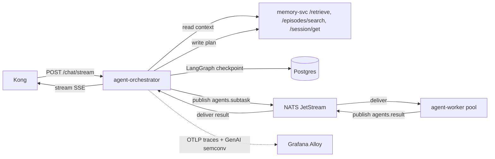

# agent-orchestrator

The platform's lead-agent reference implementation. FastAPI front, LangGraph state machine, NATS publisher, Postgres LangGraph checkpointer.

Adapted (not copied) from the reference workload: takes the monolith's reasoning loop and splits it across NATS subtask dispatch + worker pool.

## Responsibilities

- Accept inbound `POST /chat/stream` (SSE) from Kong.
- Assemble initial context per the context-engineering doctrine (`docs/protocols/context-engineering.md`): system prompt + retrieved chunks via `memory-svc /retrieve` + session memory + tool catalog.
- Persist the plan to Graphiti as an episode via `memory-svc /episodes`.
- Dispatch subtasks on `agents.subtask.<session_id>` per the heuristic catalog (`docs/protocols/heuristic-engineering.md`): `single-step-bypass`, `parallel-fan-out`, `sequential-chain`, `max-fan-out-cap`.
- Await results on `agents.result.<session_id>`; deduplicate by `(run_id, subtask_id)` via Redis.
- Reconcile and stream the final response back through Kong.
- Apply termination heuristics (`run-deadline`, `step-budget`, `token-budget`, `cost-budget`).

## One service per role

One orchestrator implementation. No "lite" alternative.

## Install and setup

The service is built into a container image by GitHub Actions CI; the image is reconciled to the cluster by ArgoCD per the workload's namespace.

Local development:

```bash
cd services/L3-agent-runtime/agent-orchestrator
uv sync                          # install Python deps
uv run pytest                    # unit tests
uv run uvicorn src.main:app      # run locally (requires platform services reachable)
```

Container build:

```bash
docker build -t agent-orchestrator:dev .
```

In-cluster deploy:

```bash
helm upgrade --install agent-orchestrator ./k8s/helm \
  --namespace workload-<app>-<env> \
  --values k8s/helm/values.yaml
```

## Flow



## References

- LangGraph documentation: https://langchain-ai.github.io/langgraph/
- LangGraph Postgres checkpointer: https://pypi.org/project/langgraph-checkpoint-postgres/
- FastAPI: https://fastapi.tiangolo.com/
- NATS Python client: https://github.com/nats-io/nats.py
- Reference workload source: https://github.com/FareedKhan-dev/production-grade-agentic-system
- Doctrines applied: `docs/protocols/context-engineering.md`, `docs/protocols/heuristic-engineering.md`
- Layer specification: `docs/layers/L3-agent-runtime/README.md`

## Status

Service code lands at Stage 07.
