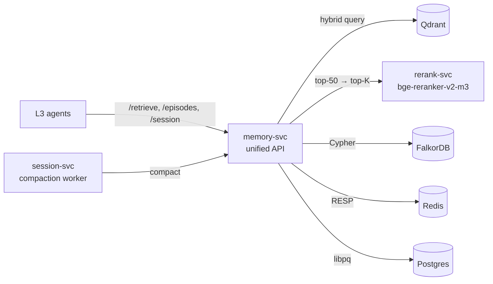

# L4 — Memory services

## Contents

| Service | Role |
|---|---|
| `memory-svc/` | Unified memory API over Graphiti + Qdrant + Redis + Postgres. Hosts the platform `/retrieve` endpoint (hybrid search + reranking). |
| `session-svc/` | Conversation compaction worker. Implements the Compression dimension of context engineering. |
| `rerank-svc/` | Cross-encoder reranker. `BAAI/bge-reranker-v2-m3` self-hosted, no provider alternatives. |

## References

- Layer specification: `docs/layers/L4-context-and-memory/README.md`.
- Decision rationale: `docs/adr/0004-graph-memory-graphiti-falkordb.md`.
- Doctrines applied: `docs/protocols/context-engineering.md`, `docs/protocols/rag-architecture.md`.
