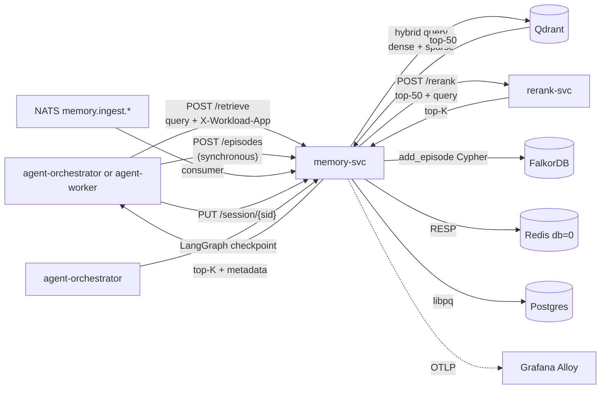

# memory-svc

The platform's unified memory API. Exposes `/episodes`, `/vectors`, `/session/*`, and the key endpoint `/retrieve` (hybrid search + reranking) over a single HTTP surface.

## Responsibilities

- One API for four backends: Graphiti-on-FalkorDB, Qdrant, Redis, Postgres LangGraph checkpointer.
- Per-workload partitioning via `X-Workload-App` header (Graphiti group_id, Qdrant collection, Redis prefix, Postgres RLS).
- Hybrid search (dense + sparse + RRF) and reranking pipeline behind `POST /retrieve`.
- Asynchronous ingestion consumer on NATS `memory.ingest.<workload_app>`.

## One memory API

Agents do not talk to Qdrant, FalkorDB, or Redis directly. memory-svc is the only path. Enforced by NetworkPolicy.

## Install and setup

```bash
# Local dev
cd services/L4-context-and-memory/memory-svc
uv sync
uv run uvicorn src.main:app

# In-cluster (Stage 08)
helm upgrade --install memory-svc ./k8s/helm \
  --namespace ai-platform \
  --values k8s/helm/values.yaml
```

Connects to:
- `qdrant.ai-platform:6334` (gRPC).
- `falkordb.ai-platform:6379` (Redis protocol).
- `redis.ai-platform:6379` (Redis protocol, separate from FalkorDB).
- `postgres-app-rw.ai-platform:5432` (libpq).
- `rerank-svc.ai-platform:8080` (HTTP).
- NATS `nats.ai-platform:4222`.

## Flow



## References

- Graphiti documentation: https://github.com/getzep/graphiti
- Qdrant Python client: https://qdrant.tech/documentation/quickstart/
- FastAPI: https://fastapi.tiangolo.com/
- Doctrines applied: `docs/protocols/context-engineering.md`, `docs/protocols/rag-architecture.md`
- Layer specification: `docs/layers/L4-context-and-memory/README.md`
- Decision rationale: `docs/adr/0004-graph-memory-graphiti-falkordb.md`

## Status

Service code lands at Stage 08.
