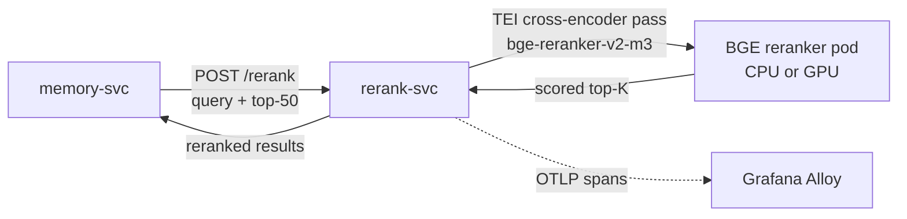

# rerank-svc

The platform's cross-encoder reranking service. One responsibility: take a query plus a top-50 candidate list from hybrid search and return the top-K reranked candidates.

## Why a separate service

Reranking is a cross-encoder pass (the model sees `query + chunk` together, unlike the bi-encoder pass that produced the candidates). Cross-encoder inference is order-of-magnitude slower than vector lookup but is the single most cost-effective quality lift in the retrieval stack. Separating it from `memory-svc` lets us:

- Place the reranker on a GPU node when warranted, without dragging the rest of memory-svc onto GPU.
- Scale rerank capacity independently of vector-search capacity.

## The reranker — one model only

`BAAI/bge-reranker-v2-m3` self-hosted. No alternatives. No provider switch.

Per platform principle: one stack per use case. We do not offer Cohere Rerank API, Voyage Rerank API, or any other reranker as a swap. Every retrieval in the platform passes through this one model.

- License: MIT.
- Disk: 568 MB.
- Peak RAM during inference: ~1.5 GB.
- CPU is acceptable for the target throughput (~150 ms p99 on top-50 → top-5 batches).
- GPU placement available via the `runtime=gpu` node selector when measured throughput requires it.

Implementation: `text-embeddings-inference` (TEI) server image from HuggingFace, configured for reranker mode.

## Install and setup

The service is deployed via its own Helm chart at `platform/L4-data-plane/rerank-svc/` (Stage 08 deliverable). The Helm chart:

- Pulls the TEI image with the BGE reranker model baked in.
- Exposes port 8080 inside the cluster as Service `rerank-svc.ai-platform`.
- Mounts a 2 GB ephemeral volume for model cache.
- Sets resource requests of 2 vCPU / 4 GB RAM (CPU mode); 1 GPU / 8 GB RAM (GPU mode).

The platform Helm install pattern:

```bash
helm upgrade --install rerank-svc \
  ./platform/L4-data-plane/rerank-svc \
  --namespace ai-platform \
  --create-namespace \
  --values platform/L4-data-plane/rerank-svc/values.yaml
```

(This is the local-development path. In production this is reconciled by ArgoCD per ADR-0008; the Helm command is not run manually.)

## API

```
POST /rerank
{
  "query": "string",
  "candidates": [
    {"id": "chunk_id", "text": "chunk_content", "metadata": {...}}
  ],
  "top_k": 5
}
→
{
  "results": [
    {"id": "chunk_id", "score": 0.94, "metadata": {...}}
  ],
  "model": "bge-reranker-v2-m3",
  "duration_ms": 142
}
```

Called by `memory-svc` from inside `POST /retrieve`. No direct callers from L3 services.

## Flow



## Telemetry

Standard OTel spans:
- `service.name = rerank-svc`
- Histogram `rerank.duration_ms` with labels `candidate_count`, `top_k`.
- Counter `rerank.requests_total`.
- Counter `rerank.failures_total` with `error.type`.

## References

- BGE reranker model card: https://huggingface.co/BAAI/bge-reranker-v2-m3
- Text Embeddings Inference (TEI) GitHub: https://github.com/huggingface/text-embeddings-inference
- RAG architecture doctrine: `docs/protocols/rag-architecture.md`
- L4 layer specification: `docs/layers/L4-context-and-memory/README.md`

## Status

Documentation contract in place at Stage 00. Service lands at Stage 08.
