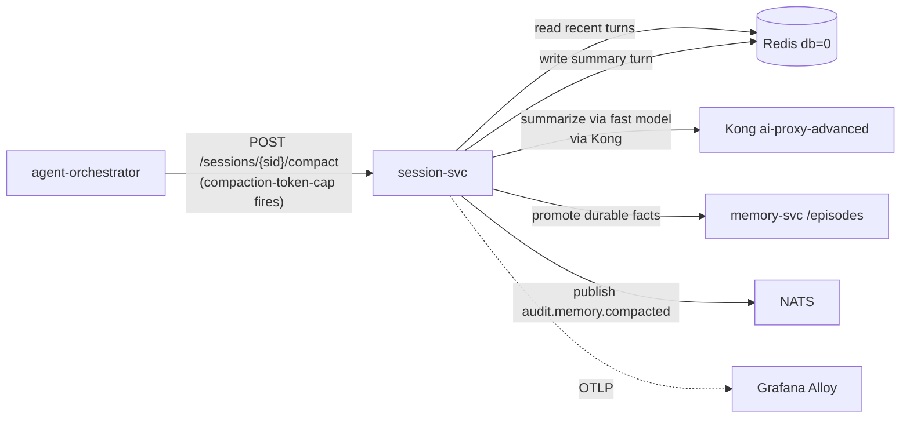

# session-svc

The platform's conversation compaction worker. Implements the Compression dimension of context engineering for session-scoped memory.

## Responsibilities

- Triggered by `compaction-token-cap` (default 8K) and `compaction-turn-cap` (default 24) heuristics from `agent-orchestrator`.
- Read recent turns from Redis (short-term memory).
- Summarize the oldest portion via a fast model.
- Promote durable facts to Graphiti episodes via `memory-svc /episodes`.
- Write the summary back to Redis as a new "summary turn"; truncate the originals.
- Emit `audit.memory.compacted` event.

## One compaction strategy

Sliding-window + summarization. We do not maintain a parallel "no compaction" mode; agents that need full history call `memory-svc /episodes/search` with a wider time window.

## Install and setup

```bash
# Local dev
cd services/L4-context-and-memory/session-svc
uv sync
uv run python -m src.main

# In-cluster (Stage 08)
helm upgrade --install session-svc ./k8s/helm \
  --namespace ai-platform \
  --values k8s/helm/values.yaml
```

## Flow



## References

- Doctrines applied: `docs/protocols/context-engineering.md` (Compression dimension), `docs/protocols/heuristic-engineering.md` (compaction heuristics)
- Layer specification: `docs/layers/L4-context-and-memory/README.md`

## Status

Service code lands at Stage 08.
