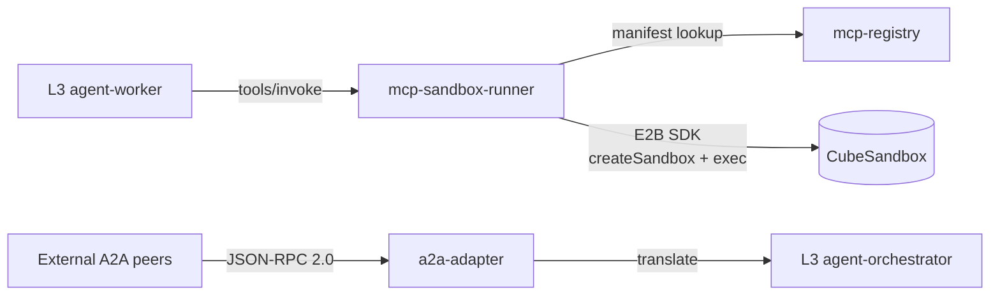

# L5 — Tooling and Integration services

## Contents

| Service | Role |
|---|---|
| `mcp-registry/` | MCP tool catalog. Loads manifests from `shared/proto/mcp/` at startup. |
| `mcp-sandbox-runner/` | Tool execution entry point. Validates input, enforces allowlist, allocates CubeSandbox via E2B SDK, captures output, emits audit events. |
| `a2a-adapter/` | A2A protocol adapter. Serves Agent Cards, accepts inbound JSON-RPC 2.0 tasks, provides outbound A2A client. |

## References

- Layer specification: `docs/layers/L5-tooling-and-integration/README.md`.
- Decision rationale: `docs/adr/0005-tool-sandbox-cubesandbox.md`, `docs/adr/0003-protocols-mcp-and-a2a.md`.
- Protocol notes: `docs/protocols/mcp.md`, `docs/protocols/a2a.md`.
