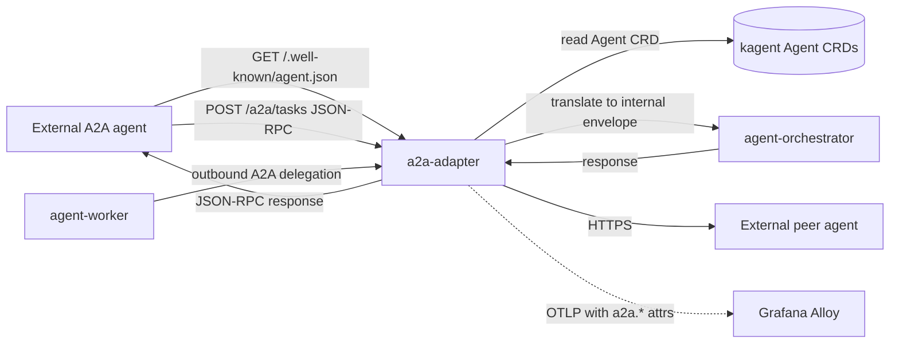

# a2a-adapter

The platform's only A2A inter-agent communication adapter. Publishes Agent Cards at `/.well-known/agent.json` per workload, accepts inbound JSON-RPC 2.0 tasks, provides outbound A2A client for L3 services.

## Responsibilities

- Inbound: serve `/.well-known/agent.json` (generated from kagent `Agent` CRD `a2aSkills` field); accept `POST /a2a/tasks` (JSON-RPC 2.0) and translate into internal `SubtaskRequest` envelope.
- Outbound: A2A client used by L3 services for delegating to peer agents outside the cluster.
- Apply governance: validate peer JWT, apply per-peer rate limits, log peer identity for audit.
- Emit OTLP spans with A2A-specific attributes (`a2a.task.id`, `a2a.peer.agent`, `a2a.direction`).

## One adapter

ACP, BeeAI, AGNTCY all consolidated under A2A at the Linux Foundation. We implement A2A only (ADR-0003).

## Install and setup

```bash
# Local dev
cd services/L5-tooling-integration/a2a-adapter
uv sync
uv run uvicorn src.main:app

# In-cluster (Stage 10)
helm upgrade --install a2a-adapter ./k8s/helm \
  --namespace ai-platform \
  --values k8s/helm/values.yaml
```

## Flow



## References

- A2A protocol: https://a2a-protocol.org
- A2A SDKs: https://github.com/a2a-protocol
- Linux Foundation A2A launch: https://www.linuxfoundation.org/press/linux-foundation-launches-the-agent2agent-protocol-project-to-enable-secure-intelligent-communication-between-ai-agents
- Protocol note: `docs/protocols/a2a.md`
- Decision rationale: `docs/adr/0003-protocols-mcp-and-a2a.md`

## Status

Service code lands at Stage 10.
