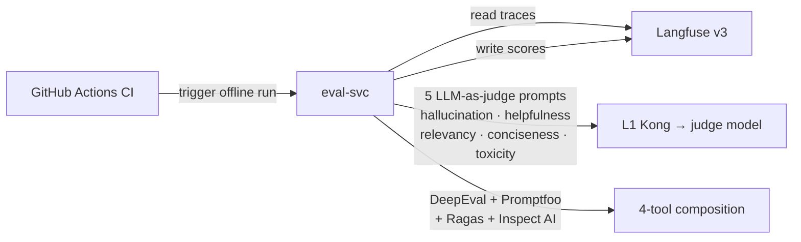

# L7 — Evaluation services

## Contents

| Service | Role |
|---|---|
| `eval-svc/` | Online LLM-as-judge scoring of live Langfuse traces (5 metrics) + offline orchestration of the 4-tool CI harness composition. |

## References

- Layer specification: `docs/layers/L7-observability-reliability/README.md`.
- Harness engineering doctrine: `docs/protocols/harness-engineering.md`.
- Five-metric prompts ported from: `docs/reference/upstream-repo-mapping.md`.
