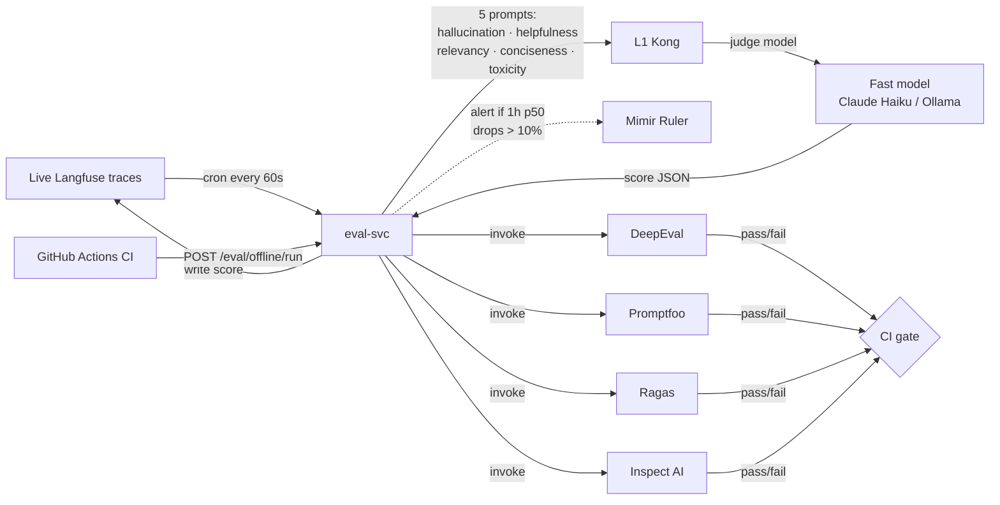

# eval-svc

The platform's evaluation orchestration service. Two responsibilities:

1. **Online**: score live Langfuse traces against the five LLM-as-judge metric prompts ported from the reference workload.
2. **Offline**: drive the four-tool CI harness composition (DeepEval + Promptfoo + Ragas + Inspect AI) against golden datasets on every PR that touches agent-runtime, memory, tooling, or evaluation services.

This service is the platform's *quality closure*. Without it, regressions in agent behavior are invisible until users report them.


## Flow




## The five online LLM-as-judge metrics

Prompts ported verbatim from `FareedKhan-dev/production-grade-agentic-system/evals/prompts/` (see `docs/reference/upstream-repo-mapping.md`):

| Metric | What it measures |
|---|---|
| **hallucination** | Whether the agent's response contains factual claims not grounded in retrieved context or known sources |
| **helpfulness** | Whether the response answers what the user actually asked |
| **relevancy** | Whether the response stays on-topic vs drifts |
| **conciseness** | Whether the response is appropriately scoped for the question |
| **toxicity** | Whether the response contains harmful, biased, or policy-violating content |

Prompts live in `prompts/{metric}.md`. The scorer module reads each prompt as a string template, fills in the trace's input/output, calls a fast judge model (default Claude Haiku or local Ollama for cost), parses the structured score, writes it back to the Langfuse trace as a score with the metric name.

## The four-tool offline harness composition

Per `docs/protocols/harness-engineering.md`, no single tool covers all four evaluation layers. eval-svc orchestrates four:

| Tool | Layer | Invocation surface |
|---|---|---|
| **DeepEval** | Application unit (pytest-style) | `pytest evals/deepeval-suites/` |
| **Promptfoo** | Prompt matrices + red-team | `promptfoo eval -c evals/promptfoo/*.yaml` |
| **Ragas** | RAG quality (Faithfulness, Answer Relevancy, Context Precision, Context Recall) | `python -m ragas evals/ragas-suites/` |
| **Inspect AI** | UK AISI composable safety/capability evals | `inspect eval evals/inspect-suites/` |

eval-svc exposes a single CI-facing entry point (`POST /eval/offline/run`) that fans out to all four tool runners and aggregates results into a single PR-comment report.

## API

| Endpoint | Purpose |
|---|---|
| `POST /eval/online/score` | Synchronously score a single Langfuse trace against the five metrics |
| `POST /eval/offline/run` | Trigger the full four-tool harness against a named dataset; returns a run id |
| `GET /eval/offline/runs/{id}` | Poll for a run's status and report |
| Cron-internal | Reads new Langfuse traces every 60 s, scores them, writes scores back |

## Prompts directory

```
prompts/
  hallucination.md
  helpfulness.md
  relevancy.md
  conciseness.md
  toxicity.md
```

These files are the platform's *quality contract*. Changing them changes what "good" means; treat them as part of the public surface. PRs that modify a prompt require an ADR.

## Configuration

| Setting | Default | Purpose |
|---|---|---|
| `JUDGE_MODEL` | `claude-haiku-4-5` | The fast model used for online scoring. Local Ollama is the fallback. |
| `LANGFUSE_HOST` | `langfuse-web.ai-observability` | Where to read traces and write scores |
| `SCORE_BATCH_SIZE` | 50 | Online scoring batch size per cron tick |
| `REGRESSION_ALERT_DROP_PCT` | 10 | 1-hour rolling p50 drop that fires an alert via Mimir Ruler |

## Cross-references

- `docs/protocols/harness-engineering.md` — the doctrine this service implements.
- `docs/layers/L7-observability-reliability/README.md` — the L7 layer specification.
- `docs/reference/upstream-repo-mapping.md` — origin of the five online judge prompts.
- Stage 12 README — when this lands and the acceptance criteria.

## Status

Documentation contract in place at Stage 00. Service lands at Stage 12.

## Install and setup

The service is built into a container image by GitHub Actions CI; the image is reconciled by ArgoCD per ADR-0008.

Local development:

```bash
cd services/L7-evaluation/eval-svc
uv sync                                # install Python deps
uv run pytest                          # unit tests
uv run uvicorn src.main:app --port 8090
```

Container build:

```bash
docker build -t eval-svc:dev .
```

In-cluster deploy (Stage 12):

```bash
helm upgrade --install eval-svc ./k8s/helm \
  --namespace ai-observability \
  --values k8s/helm/values.yaml
```

Connects to:
- `langfuse-web.ai-observability:3000` (read traces, write scores).
- `kong.ai-gateway:8000` (LLM call routing for the judge model).
- `clickhouse.ai-observability:9000` (historical score queries).

The cron-triggered online scoring job runs every 60 seconds with `SCORE_BATCH_SIZE` traces (default 50). Offline harness runs are invoked from CI via `POST /eval/offline/run` with a dataset reference.
