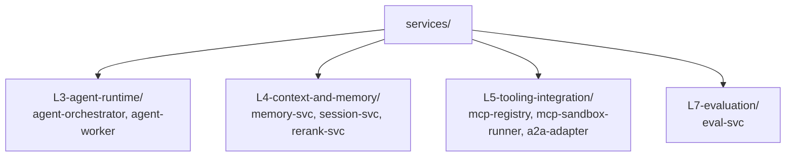

# services/

Application services that ride on the platform. Each service is its own Python project with its own `pyproject.toml`, `Dockerfile`, Helm chart, and tests. Services are organized under their owning layer.

Shared code lives in `shared/py-common/`; shared schemas live in `shared/proto/`.

## Service contract

Every service ships with:

- `pyproject.toml` using `uv` for dependency resolution.
- `Dockerfile` producing a small image (distroless or `python:3.12-slim` base).
- `k8s/helm/` chart with templated values for per-workload deployment.
- `tests/` with unit, integration (testcontainers), contract (schemathesis / AsyncAPI), and load (locust) suites — see `docs/protocols/testing-strategy.md`.
- `README.md` with install/setup, embedded flow diagram, and references.

## References

- Testing strategy doctrine: `docs/protocols/testing-strategy.md`.
- Harness engineering doctrine: `docs/protocols/harness-engineering.md`.
- Each service's own README under the layer subfolders.
