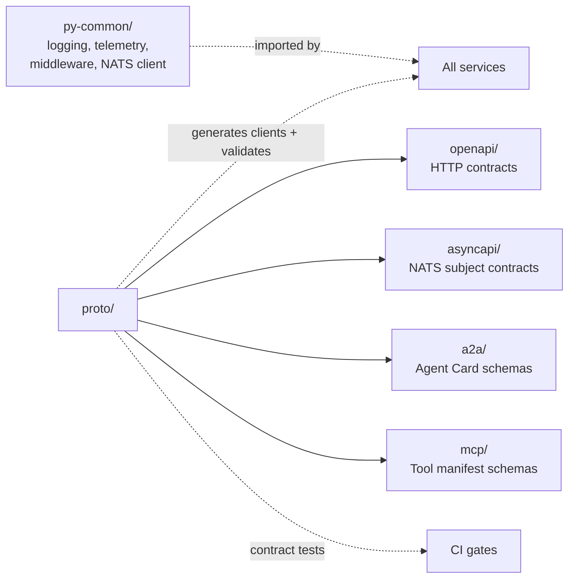

# shared/

Code and schemas reused across every service. Two subtrees: `py-common/` (shared Python library), `proto/` (schema-first contracts).

## References

- Testing strategy doctrine: `docs/protocols/testing-strategy.md` — describes how the contracts under `proto/` are enforced as contract tests in CI.
- OpenAPI: https://spec.openapis.org/
- AsyncAPI: https://www.asyncapi.com/
