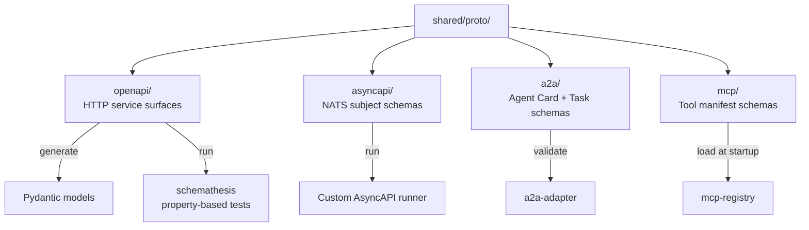

# shared/proto/

Schema-first contracts. The single source of truth for inter-service interfaces. Code is generated from these (Pydantic models, OpenAPI clients) or validated against them (contract tests, AsyncAPI runners).

## Contract

Any change to a schema in this directory triggers contract tests in CI. Producers and consumers are validated independently; a producer's PR is blocked if any consumer's schema cannot decode messages valid under the new spec.

## References

- Testing strategy doctrine: `docs/protocols/testing-strategy.md`.
- MCP specification: `docs/protocols/mcp.md`.
- A2A specification: `docs/protocols/a2a.md`.
- schemathesis: https://schemathesis.readthedocs.io/.
