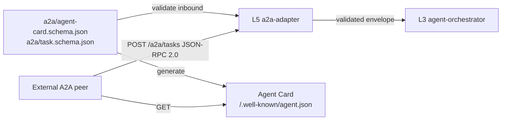

# shared/proto/a2a/

A2A protocol schemas. Source for `a2a-adapter`'s inbound JSON-RPC handling and Agent Card generation.

## Files

- `agent-card.schema.json` — JSON Schema for the Agent Card document.
- `task.schema.json` — JSON Schema for the A2A Task object.
- `jsonrpc-envelope.schema.json` — JSON-RPC 2.0 envelope for A2A.

## References

- A2A specification site: https://a2a-protocol.org
- Protocol note: `docs/protocols/a2a.md`.
- Decision rationale: `docs/adr/0003-protocols-mcp-and-a2a.md`.
