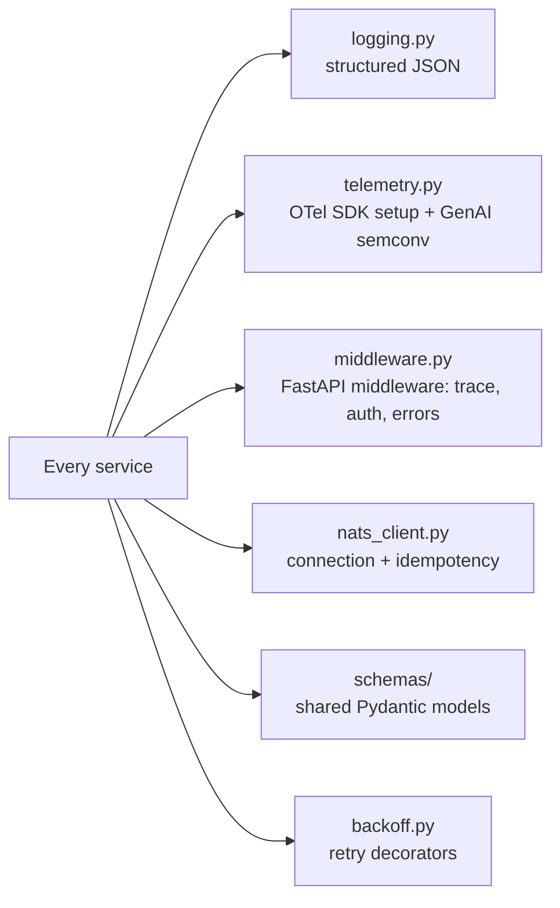

# shared/py-common/

Shared Python library imported by every service. Lifts the small, well-tested utilities from the reference workload's `app/common/` into a packageable shared module so each service does not reinvent them.

## Contract

Every service installs `py-common` as a dependency. Services do not reimplement logging, OTel SDK setup, NATS idempotency, or retry logic; they import from here.

## References

- Reference workload mapping: `docs/reference/upstream-repo-mapping.md`.
- OTel GenAI semconv: `docs/protocols/otel-genai-semconv.md`.
- Testing strategy: `docs/protocols/testing-strategy.md`.
