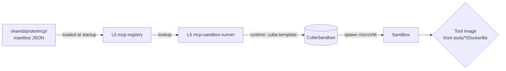

# tools/

MCP tool implementations executed inside CubeSandbox. Each tool is packaged as a sandbox template image referenced from its manifest in `shared/proto/mcp/`. The platform ships three reference tools; workload-specific tools live with the workload or are added here as the catalog grows.

## Contents

| Tool | Purpose |
|---|---|
| `web-search/` | Public web search via Tavily. |
| `doc-search/` | Semantic search over the workload's Qdrant collection via `memory-svc /retrieve`. |
| `code-exec/` | Arbitrary code execution inside a fresh CubeSandbox microVM. |

## References

- MCP specification: https://modelcontextprotocol.io/
- Protocol note: `docs/protocols/mcp.md`.
- Layer specification: `docs/layers/L5-tooling-and-integration/README.md`.
- CubeSandbox: https://github.com/TencentCloud/CubeSandbox
