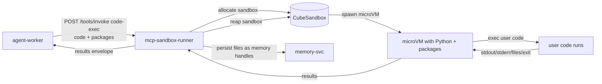

# code-exec MCP tool

Reference MCP tool that executes arbitrary code inside CubeSandbox. The single highest-blast-radius tool on the platform; CubeSandbox isolation is what makes it safe.

## What it does

Takes a code blob (Python by default), runs it in a fresh sandbox with the requested packages pre-installed, returns stdout, stderr, exit code, and any produced files (returned as memory-svc handles).

## One sandbox

CubeSandbox is the only sandbox per ADR-0005. No fallback to Docker-in-Docker or local subprocess.

## Install and setup

```bash
cd tools/code-exec
docker build -t infra-ai/tool-code-exec:1.0.0 .
docker push <registry>/infra-ai/tool-code-exec:1.0.0
```

## Manifest summary

| Field | Value |
|---|---|
| `name` | `code-exec` |
| `runtime` | `cube-template:tool-code-exec:1.0.0` |
| `egress` | `none` (default; workloads override per-call when needed via explicit `allowlist`) |
| `timeout_ms` | 30000 |
| `resources` | 2 vCPU / 1 GiB |
| `requires_approval` | true when egress is non-empty |

## Flow



## References

- CubeSandbox: https://github.com/TencentCloud/CubeSandbox
- E2B SDK: https://github.com/e2b-dev/E2B
- Decision rationale: `docs/adr/0005-tool-sandbox-cubesandbox.md`
- Layer specification: `docs/layers/L5-tooling-and-integration/README.md`

## Status

Tool implementation lands at Stage 09.
