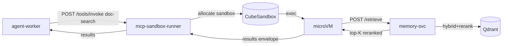

# doc-search MCP tool

Reference MCP tool that does semantic search over the workload's Qdrant collection via `memory-svc /retrieve`. No external egress needed.

## What it does

Takes a query, calls `memory-svc /retrieve` (which runs hybrid search + reranking per the RAG architecture doctrine), returns top-K reranked chunks.

## Why a tool, not a direct memory-svc call

Agents can call memory-svc directly. The tool wrapper exists for cases where the agent's planner reasons about "documents to search" as a callable capability rather than a backend API. The same hybrid + RRF + rerank pipeline runs underneath.

## Install and setup

```bash
cd tools/doc-search
docker build -t infra-ai/tool-doc-search:1.0.0 .
docker push <registry>/infra-ai/tool-doc-search:1.0.0
```

## Manifest summary

| Field | Value |
|---|---|
| `name` | `doc-search` |
| `runtime` | `cube-template:tool-doc-search:1.0.0` |
| `egress` | `allowlist:[memory-svc.ai-platform]` |
| `timeout_ms` | 5000 |
| `resources` | 0.5 vCPU / 128 MiB |
| `requires_approval` | false |

## Flow



## References

- RAG architecture doctrine: `docs/protocols/rag-architecture.md`
- memory-svc: `services/L4-context-and-memory/memory-svc/README.md`
- Layer specification: `docs/layers/L5-tooling-and-integration/README.md`

## Status

Tool implementation lands at Stage 09.
