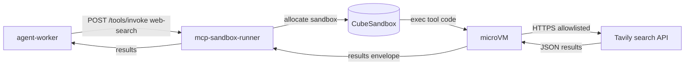

# web-search MCP tool

Reference MCP tool that searches the public web. One of the three platform-shipped tools (with `doc-search` and `code-exec`).

## What it does

Takes a query, calls a configured search provider, returns top-N results with title, URL, snippet.

## One provider

We pick one provider for the platform-shipped tool. Workloads that want a different provider create a workload-specific tool with a different manifest. The platform tool is opinionated.

Currently configured provider: **Tavily** (the default in the reference workload). API key in K8s Secret `tavily-api-key` in the workload namespace.

## Install and setup

The tool is packaged as a CubeSandbox template image. Build:

```bash
cd tools/web-search
docker build -t infra-ai/tool-web-search:1.0.0 .
docker push <registry>/infra-ai/tool-web-search:1.0.0
```

The manifest at `shared/proto/mcp/web-search.json` references the image tag; `mcp-sandbox-runner` pulls and executes it.

## Manifest summary

| Field | Value |
|---|---|
| `name` | `web-search` |
| `runtime` | `cube-template:tool-web-search:1.0.0` |
| `egress` | `allowlist:[api.tavily.com]` |
| `timeout_ms` | 10000 |
| `resources` | 1 vCPU / 256 MiB |
| `requires_approval` | false |

## Flow



## References

- Tavily: https://tavily.com/
- MCP specification: https://modelcontextprotocol.io/
- Protocol note: `docs/protocols/mcp.md`
- Layer specification: `docs/layers/L5-tooling-and-integration/README.md`

## Status

Tool implementation lands at Stage 09.
