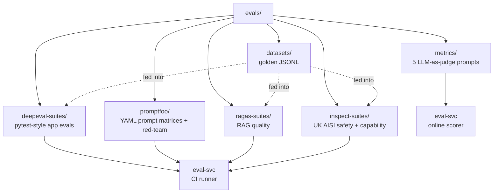

# evals/

The platform's evaluation artifacts: golden datasets, DeepEval suites, Promptfoo configs, Ragas suites, Inspect AI suites, and the five LLM-as-judge metric prompts. These artifacts are consumed by `eval-svc` (online scoring) and CI (offline gating).

## Why a four-tool composition

No single evaluation tool covers all four layers (application unit, prompt matrix + red-team, RAG-specific, safety + capability). The doctrine `docs/protocols/harness-engineering.md` explains the choice in detail.

## References

- Harness engineering doctrine: `docs/protocols/harness-engineering.md`.
- Testing strategy doctrine: `docs/protocols/testing-strategy.md`.
- DeepEval: https://github.com/confident-ai/deepeval
- Promptfoo: https://www.promptfoo.dev/
- Ragas: https://docs.ragas.io/
- Inspect AI (UK AISI): https://inspect.ai-safety-institute.org.uk/
