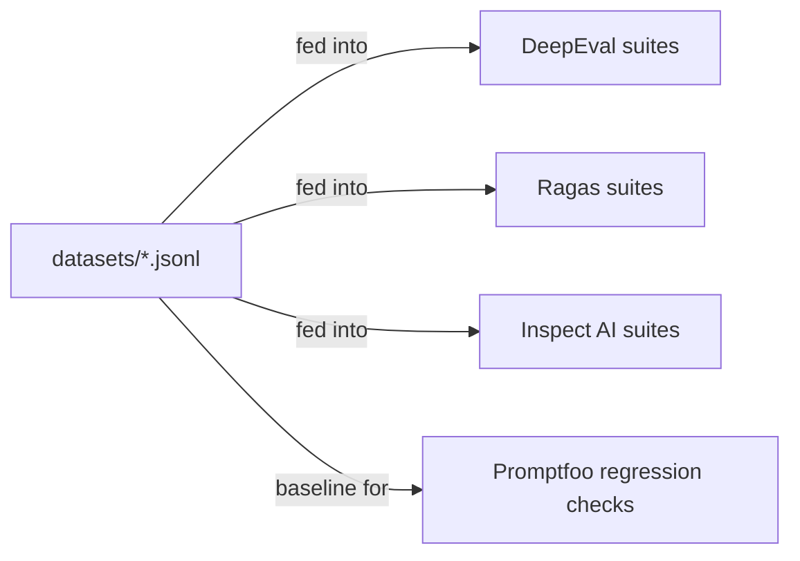

# evals/datasets/

Golden datasets used by both offline CI gating and online regression detection. JSONL format; one record per line.



## Files

- `agent-flow-basic.jsonl` — canonical multi-step agent runs (input + expected output).
- `rag-faithfulness.jsonl` — Q/A pairs for RAGAS Faithfulness, Answer Relevancy, Context Precision, Context Recall.
- `tool-selection-edge-cases.jsonl` — ambiguous and adversarial inputs that test the `tool-allowlist-check` and `tool-loop-detect` heuristics.
- `safety-probes.jsonl` — jailbreak and prompt-injection vectors for Inspect AI's safety suite.

## Format

```json
{"id": "unique-id", "input": {...}, "expected": {...}, "tags": ["...", "..."]}
```

The `expected` shape varies by suite. RAGAS records carry a `ground_truth` field; DeepEval records carry an `expected_output`; Inspect records carry an `expected_disposition` (`refuse` / `comply` / `clarify`).

## References

- Harness engineering doctrine: `docs/protocols/harness-engineering.md`.
- RAG architecture doctrine: `docs/protocols/rag-architecture.md` — defines the RAGAS thresholds asserted against this data.
