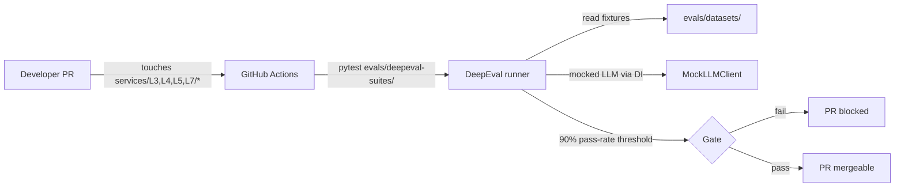

# evals/deepeval-suites/

DeepEval pytest-style application-unit evaluations. Owned by the harness composition's *application unit* layer per `docs/protocols/harness-engineering.md`.

## Files

- `test_agent_orchestrator.py` — orchestrator's dispatch + reconciliation logic.
- `test_agent_worker.py` — worker's tool-selection + LLM-call behavior.
- `test_memory_svc.py` — `/retrieve` correctness against golden datasets.
- `test_heuristics.py` — every entry in the heuristic catalog of `docs/protocols/heuristic-engineering.md` is asserted here.
- `test_multi_agent_flows.py` — fixture-based "tape" replay tests for orchestrator-worker message flows.

## References

- DeepEval documentation: https://docs.confident-ai.com/
- Heuristic engineering catalog: `docs/protocols/heuristic-engineering.md`.
- Testing strategy: `docs/protocols/testing-strategy.md`.
