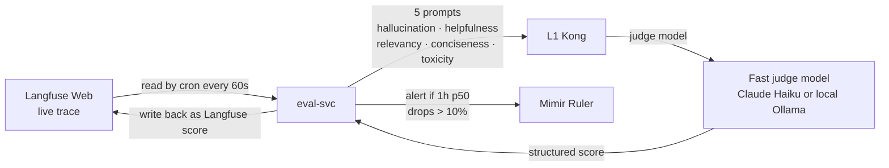

# evals/metrics/

The five LLM-as-judge metric prompts, ported verbatim from the reference workload. Used by `eval-svc` for online scoring of every Langfuse trace.

## Files

- `hallucination.md` — Does the response contain claims not grounded in retrieved context?
- `helpfulness.md` — Does the response answer what was asked?
- `relevancy.md` — Does the response stay on-topic?
- `conciseness.md` — Is the response appropriately scoped?
- `toxicity.md` — Does the response contain harmful, biased, or policy-violating content?

## Contract

Each file is a prompt template with two named placeholders: `{input}` and `{output}`. The judge LLM returns a JSON object with `score` (0.0–1.0) and `rationale` (free text). `eval-svc` parses the response and writes the score back to the Langfuse trace.

A PR that modifies a prompt requires an ADR — changing a prompt changes what "good" means.

## References

- Harness engineering doctrine: `docs/protocols/harness-engineering.md`.
- Reference workload mapping: `docs/reference/upstream-repo-mapping.md`.
- Stage 12 acceptance criteria: `docs/stages/STAGE-12-evaluation/README.md`.
