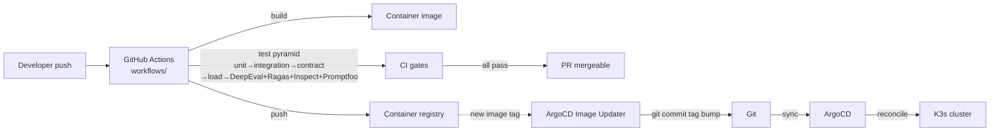

# .github/

CI configuration and GitHub-specific automation. ArgoCD is the *deployment* mechanism (ADR-0008); GitHub Actions is the *CI* mechanism that produces images, runs tests, runs the harness, and notifies ArgoCD Image Updater of new images.

## Contents

- `workflows/` — GitHub Actions workflow definitions for CI.

## References

- Decision rationale: `docs/adr/0008-cicd-github-actions-argocd.md`.
- Testing strategy: `docs/protocols/testing-strategy.md`.
- Harness engineering: `docs/protocols/harness-engineering.md`.
