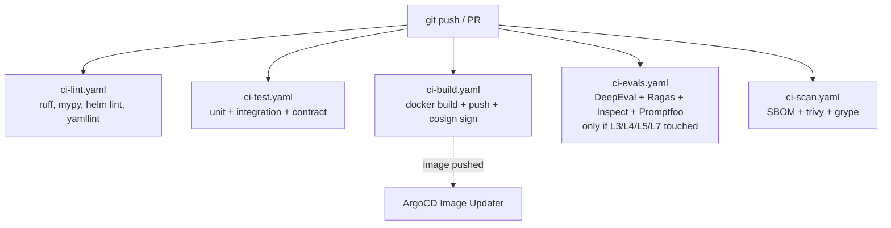

# .github/workflows/

GitHub Actions workflow definitions.

## Workflows (Stage 13 deliverable)

- `ci-lint.yaml` — Python linting, type-checking, Helm lint, YAML lint.
- `ci-test.yaml` — unit and integration tests via testcontainers; contract tests via schemathesis + AsyncAPI runner.
- `ci-build.yaml` — Docker build with BuildKit cache, push, cosign signing.
- `ci-evals.yaml` — DeepEval + Promptfoo + Ragas + Inspect AI suites; triggered only on PRs that touch `services/L3-*`, `services/L4-*`, `services/L5-*`, `services/L7-*`.
- `ci-scan.yaml` — SBOM generation, trivy vulnerability scan, grype scan.

## Gating

A PR is mergeable only when all five workflows succeed and harness thresholds (per `docs/protocols/harness-engineering.md`) are met.

## References

- Decision rationale: `docs/adr/0008-cicd-github-actions-argocd.md`.
- Stage 13 deliverables: `docs/stages/STAGE-13-cicd-gitops/README.md`.
- GitHub Actions documentation: https://docs.github.com/en/actions
- cosign: https://github.com/sigstore/cosign
- trivy: https://aquasecurity.github.io/trivy/
