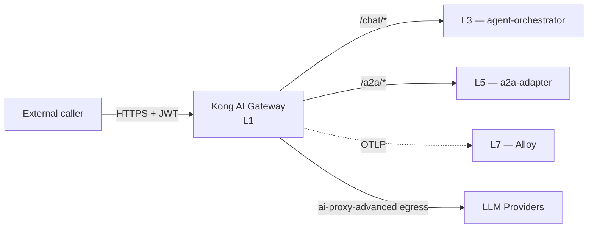

# L1 — Gateway

Kong AI Gateway installation and configuration. The only request perimeter on the platform.

## Contents

- `kong/` — Kong Helm chart values, Kong plugin configurations, AI plugin bundle settings.

## References

- Layer specification: `docs/layers/L1-interface-and-entry/README.md`.
- Decision rationale: `docs/adr/0012-gateway-kong-over-kgateway.md`.
- Kong AI Gateway product page: https://konghq.com/products/kong-ai-gateway
