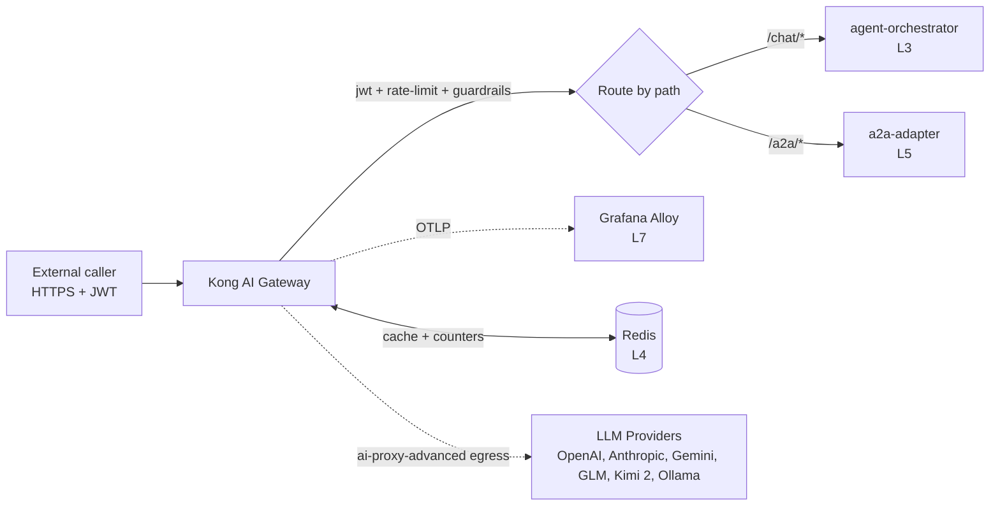

# Kong AI Gateway

The platform's only request perimeter. Kong AI Gateway (OSS, Kong 3.8+) replaces kgateway at L1 per ADR-0012.

## What it owns

- Inbound HTTPS and SSE termination for all workload traffic.
- Per-app JWT authentication.
- Token-aware rate limiting (10 rps + token budgets per app).
- Embedding-similarity semantic cache (Redis-backed).
- Prompt-injection and PII guardrails at the perimeter.
- Multi-LLM provider routing via `ai-proxy-advanced` (failover, circuit breaker, semantic routing across OpenAI, Anthropic, Gemini, GLM, Kimi 2, local Ollama).
- OTLP telemetry export to Grafana Alloy.

## Why one gateway

One stack per use case (ADR principle). Kong owns *every* north-south LLM perimeter concern; there is no parallel gateway, no fallback ingress for "simpler" routes. Traefik (K3s default) is disabled. kgateway is uninstalled.

## Install and setup

Upstream: Kong Helm chart at https://charts.konghq.com.

```bash
# Add chart repo (one-time)
helm repo add kong https://charts.konghq.com
helm repo update

# Install pinned version (managed by ArgoCD in production)
helm upgrade --install kong kong/kong \
  --version 2.41.x \
  --namespace ai-gateway \
  --create-namespace \
  --values platform/L1-gateway/kong/values.yaml
```

Pinned `values.yaml` enables the AI plugin bundle:
- `ai-proxy-advanced`
- `ai-semantic-cache`
- `ai-rate-limiting-advanced`
- `ai-prompt-guard`
- `request-transformer`
- `jwt`
- `prometheus`
- `opentelemetry` (exporter pointed at `alloy.ai-observability:4317`)

Per-app credentials and provider API keys live in K8s Secrets under `ai-gateway` namespace; never in `values.yaml`.

In production this Helm release is reconciled by ArgoCD per ADR-0008. The `helm upgrade --install` command above is for local-development bring-up only.

## Flow



## References

- Kong AI Gateway product page: https://konghq.com/products/kong-ai-gateway
- Kong AI Gateway developer docs: https://developer.konghq.com/ai-gateway/
- Kong Helm chart: https://github.com/Kong/charts
- Kong Gateway changelog (semantic routing + circuit breaker): https://developer.konghq.com/gateway/changelog/
- Layer specification: `docs/layers/L1-interface-and-entry/README.md`
- Decision rationale: `docs/adr/0012-gateway-kong-over-kgateway.md`

## Status

Helm values land at Stage 05.
