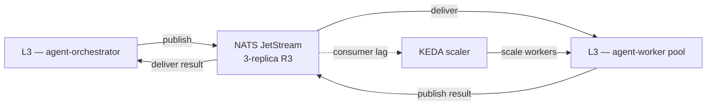

# L2 — Orchestration and Control Plane

NATS JetStream (east-west bus) and KEDA (event-driven autoscaler).

## Contents

- `nats-jetstream/` — NATS Helm chart values, stream and consumer definitions.
- `keda/` — KEDA Helm install + `ScaledObject` templates.

## References

- Layer specification: `docs/layers/L2-orchestration-control-plane/README.md`.
- Decision rationale: `docs/adr/0007-message-bus-nats-jetstream.md`.
- NATS JetStream docs: https://docs.nats.io/nats-concepts/jetstream
- KEDA docs: https://keda.sh/docs/
