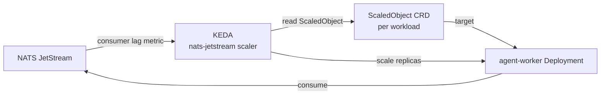

# KEDA

The platform's only autoscaler for event-driven workloads. KEDA (Kubernetes Event-driven Autoscaling) scales `agent-worker` on NATS JetStream consumer lag, not on CPU.

## What it owns

- `ScaledObject` resources that target `agent-worker` Deployments.
- One scaler implementation: `nats-jetstream`. No CPU autoscaling, no HPA-on-memory.

## Why one autoscaler

CPU-based HPA gives a poor signal for LLM-bound workloads (waiting on LLM responses is not CPU work). Consumer-lag scaling matches the orchestrator-worker pattern's actual workload shape. One scaler, one signal, no parallel pipeline.

## Install and setup

Upstream: KEDA Helm chart at https://kedacore.github.io/charts.

```bash
helm repo add kedacore https://kedacore.github.io/charts
helm repo update

helm upgrade --install keda kedacore/keda \
  --version 2.14.x \
  --namespace keda \
  --create-namespace
```

Per-workload `ScaledObject` manifests live under `services/L3-agent-runtime/agent-worker/k8s/scaledobject.yaml` (Stage 07).

Reconciled by ArgoCD in production.

## Flow



## References

- KEDA documentation: https://keda.sh/docs/
- KEDA NATS JetStream scaler: https://keda.sh/docs/scalers/nats-jetstream/
- Layer specification: `docs/layers/L2-orchestration-control-plane/README.md`

## Status

KEDA install lands at Stage 04. ScaledObjects for agent-worker land at Stage 07.
