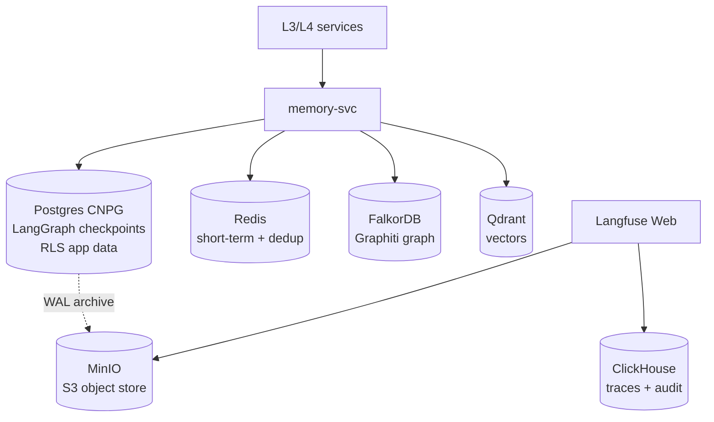

# L4 — Data Plane

All persistent stores. Six components, one per role; no parallel alternatives.

## Contents

| Folder | Role | Backed by |
|---|---|---|
| `postgres/` | Relational + LangGraph checkpoints + Langfuse metadata + Kong config | CloudNativePG operator |
| `qdrant/` | Vector store with hybrid dense+sparse + RRF | Qdrant Helm |
| `falkordb/` | Graphiti graph backend | FalkorDB Helm |
| `redis/` | Short-term memory + idempotency + Kong counters + Kong sem-cache | Bitnami Redis Helm |
| `clickhouse/` | Langfuse traces + platform_audit table | Bitnami ClickHouse Helm |
| `minio/` | S3-compatible object store | Bitnami MinIO Helm |

## References

- Layer specification: `docs/layers/L4-context-and-memory/README.md`.
- Decision rationale: `docs/adr/0004-graph-memory-graphiti-falkordb.md`.
- RAG architecture doctrine: `docs/protocols/rag-architecture.md`.
