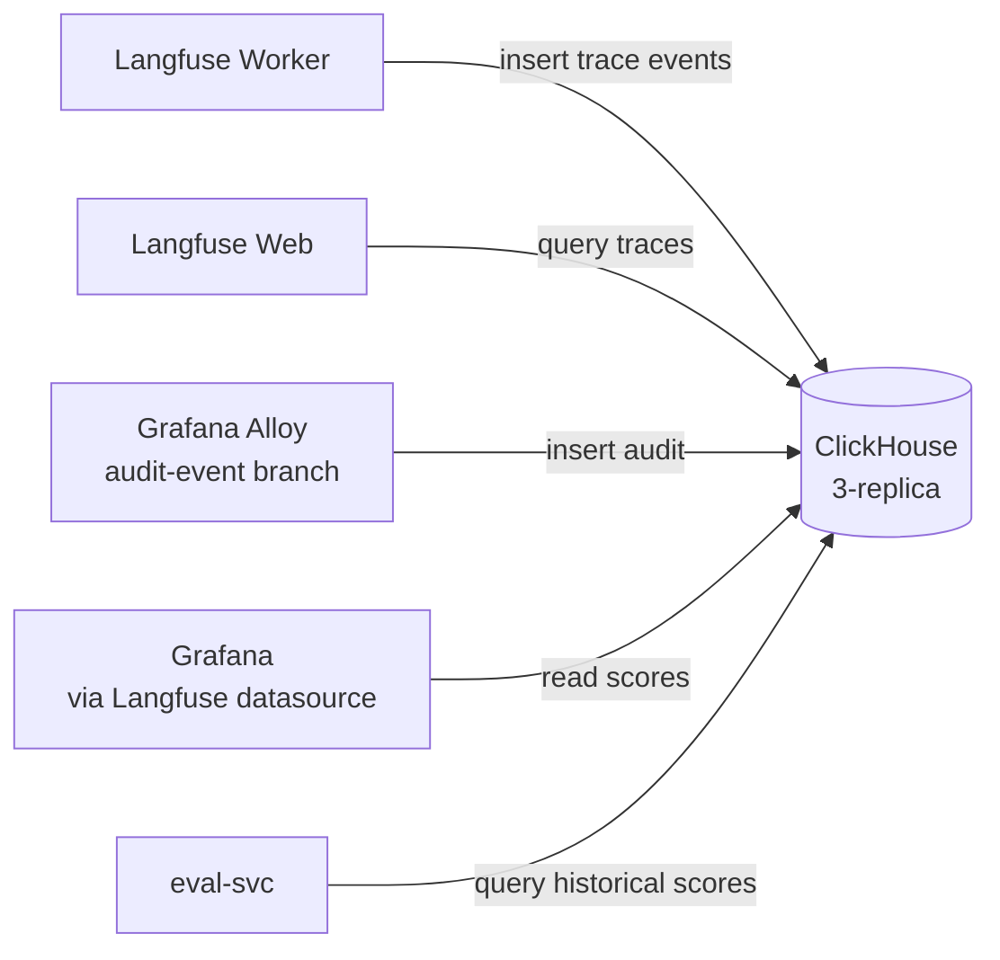

# ClickHouse

The platform's only columnar OLAP database. Backs Langfuse v3 trace storage and the `platform_audit` ledger.

## What it owns

- Langfuse traces (the high-volume per-call data).
- `platform_audit` table — append-only ledger of all policy-relevant events from L6 enforcement points (90-day retention by default).

## Why one OLAP

We do not run a second analytics database. Langfuse v3 standardizes on ClickHouse; we reuse the same cluster for the audit ledger to avoid operating two columnar stores.

## Install and setup

Upstream: Bitnami ClickHouse Helm chart (recommended in Langfuse docs).

```bash
helm repo add bitnami https://charts.bitnami.com/bitnami
helm repo update

helm upgrade --install clickhouse bitnami/clickhouse \
  --version 6.x.x \
  --namespace ai-observability \
  --values platform/L4-data-plane/clickhouse/values.yaml
```

Pinned `values.yaml`:
- `shards: 1` (start small; raise when trace volume warrants)
- `replicaCount: 3` (HA)
- `persistence.size: 200Gi`
- `keeper.enabled: true` (ClickHouse Keeper replaces ZooKeeper)
- `auth.username` + `auth.password` from K8s Secret

Reconciled by ArgoCD.

## Flow



## References

- ClickHouse documentation: https://clickhouse.com/docs
- Bitnami ClickHouse chart: https://github.com/bitnami/charts/tree/main/bitnami/clickhouse
- Langfuse self-hosting / ClickHouse: https://langfuse.com/self-hosting/infrastructure/clickhouse

## Status

Helm install lands at Stage 02.
