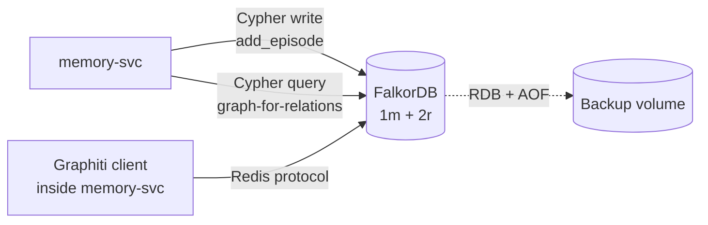

# FalkorDB

The platform's only graph backend. FalkorDB is the Graphiti backend per ADR-0004. BSD-3 license, Redis-protocol-compatible, native Cypher.

## What it owns

- Storage for Graphiti's bi-temporal knowledge graph.
- One graph per workload (`<workload_app>` group_id partitioning).
- Episodes with valid_from / valid_to timestamps.

## Why one graph backend

One stack per use case. No Neo4j (license friction), no Kuzu (embedded-only), no Memgraph (no first-class Graphiti integration). FalkorDB is the only option per ADR-0004.

## Install and setup

Upstream: FalkorDB Helm chart.

```bash
helm repo add falkordb https://falkordb.github.io/falkordb-bitnami-chart/
helm repo update

helm upgrade --install falkordb falkordb/falkordb \
  --version x.y.z \
  --namespace ai-platform \
  --values platform/L4-data-plane/falkordb/values.yaml
```

Pinned `values.yaml`:
- `architecture: replication` (1 master + 2 replicas)
- `master.persistence.size: 50Gi`
- `master.configuration` enables both RDB and AOF persistence
- `auth.enabled: true` with password from K8s Secret

Reconciled by ArgoCD.

## Flow



## References

- FalkorDB: https://www.falkordb.com/
- FalkorDB GitHub: https://github.com/FalkorDB/FalkorDB
- Graphiti GitHub: https://github.com/getzep/graphiti
- Graphiti paper: https://arxiv.org/abs/2501.13956
- Decision rationale: `docs/adr/0004-graph-memory-graphiti-falkordb.md`

## Status

Helm install lands at Stage 02.
