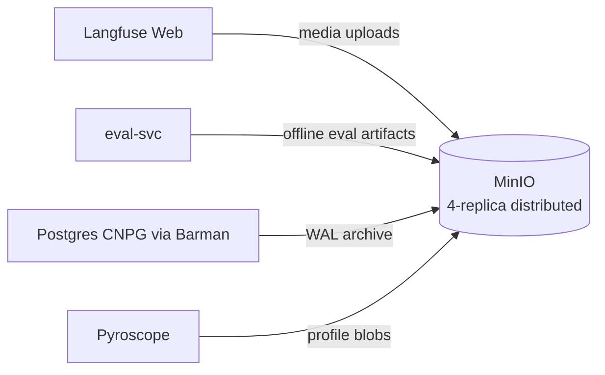

# MinIO

The platform's only S3-compatible object store. Self-hosted alternative to AWS S3 for clusters that cannot reach AWS.

## What it owns

- Langfuse media uploads (image inputs, file inputs to agents).
- Offline eval artifacts produced by `eval-svc` runs.
- Postgres WAL archives via the CNPG Barman integration.

## Why one object store

One stack per use case. In AWS production we may swap MinIO for AWS S3 by changing endpoint env vars only; the S3 client surface is identical. No parallel object store today.

## Install and setup

Upstream: Bitnami MinIO Helm chart.

```bash
helm repo add bitnami https://charts.bitnami.com/bitnami
helm repo update

helm upgrade --install minio bitnami/minio \
  --version 14.x.x \
  --namespace ai-observability \
  --values platform/L4-data-plane/minio/values.yaml
```

Pinned `values.yaml`:
- `mode: distributed` with `statefulset.replicaCount: 4` (erasure-coded HA)
- `persistence.size: 500Gi` per replica
- `auth.rootUser` + `auth.rootPassword` from K8s Secret

Reconciled by ArgoCD.

## Flow



## References

- MinIO documentation: https://min.io/docs/minio/kubernetes/upstream/
- Bitnami MinIO chart: https://github.com/bitnami/charts/tree/main/bitnami/minio
- Barman backup tool used by CNPG: https://www.pgbarman.org/

## Status

Helm install lands at Stage 02.
