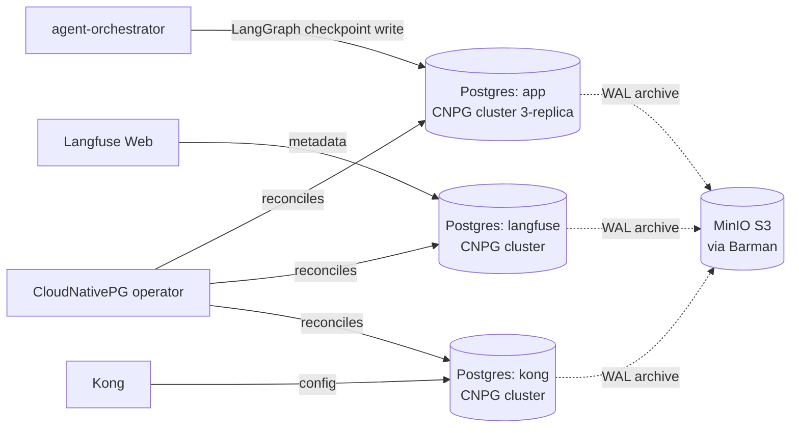

# Postgres (CloudNativePG)

The platform's only relational database. Three logical Postgres clusters managed by the CloudNativePG (CNPG) operator: one for `app` data (LangGraph checkpoints + per-workload RLS-scoped tables), one for Langfuse metadata, one for Kong.

## What it owns

- LangGraph workflow checkpoints (the `langgraph-checkpoint-postgres` schema).
- Per-workload application data with row-level security predicates keyed on `workload_app`.
- Langfuse metadata (users, projects, prompts, datasets — *not* trace data; that lives in ClickHouse).
- Kong's configuration store.

## Why one operator

CloudNativePG provides PITR, automated backups, replica promotion, instance scheduling. We do not run two Postgres operators in parallel and we do not run any Postgres instance outside CNPG.

## Install and setup

Upstream: CloudNativePG operator + per-cluster `Cluster` CRD.

```bash
# Install the operator (one-time per cluster)
helm repo add cnpg https://cloudnative-pg.github.io/charts
helm repo update

helm upgrade --install cnpg cnpg/cloudnative-pg \
  --version 0.22.x \
  --namespace cnpg-system \
  --create-namespace

# Then apply per-cluster Cluster CRDs from platform/L4-data-plane/postgres/clusters/
kubectl apply -f platform/L4-data-plane/postgres/clusters/
```

Each `Cluster` manifest defines: instances=3 (HA), storage 50Gi, WAL archiving to MinIO via Barman, point-in-time recovery enabled.

Reconciled by ArgoCD in production.

## Flow



## References

- CloudNativePG: https://cloudnative-pg.io/
- CNPG operator GitHub: https://github.com/cloudnative-pg/cloudnative-pg
- LangGraph Postgres checkpointer: https://langchain-ai.github.io/langgraph/concepts/persistence/
- Layer specification: `docs/layers/L4-context-and-memory/README.md`

## Status

Helm install lands at Stage 02.
