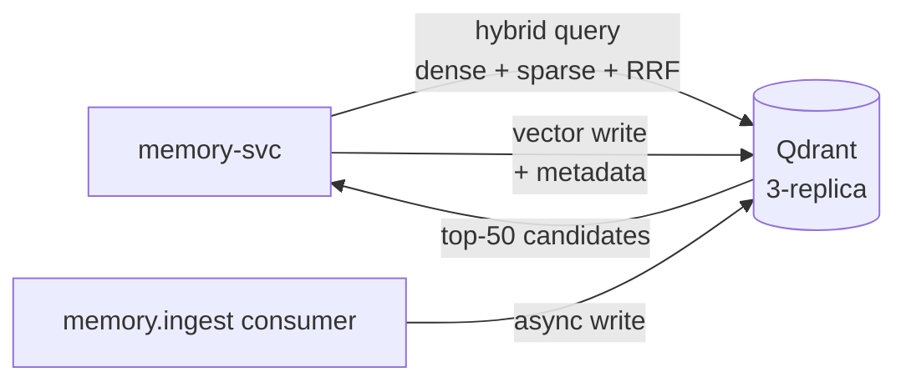

# Qdrant

The platform's only vector store. Native hybrid search (dense + sparse) with Reciprocal Rank Fusion is the reason for choosing Qdrant; the RAG architecture doctrine depends on it.

## What it owns

- One collection per workload (`<workload_app>-vectors`).
- Dense vectors: `BAAI/bge-large-en-v1.5` embeddings (1024-dim).
- Sparse vectors: BM25-style via `Qdrant/bm42-all-minilm-l6-v2-attentions`.
- Hybrid queries via `FusionQuery(fusion=Fusion.RRF)`.

## Why one vector store

One stack per use case. No pgvector parallel, no Weaviate alternative, no Pinecone. All semantic retrieval goes through Qdrant via `memory-svc`.

## Install and setup

Upstream: Qdrant Helm chart.

```bash
helm repo add qdrant https://qdrant.github.io/qdrant-helm
helm repo update

helm upgrade --install qdrant qdrant/qdrant \
  --version 0.14.x \
  --namespace ai-platform \
  --values platform/L4-data-plane/qdrant/values.yaml
```

Pinned `values.yaml`:
- `replicaCount: 3` (HA via Qdrant's built-in replication)
- `persistence.size: 100Gi`
- `service.type: ClusterIP` (only `memory-svc` reaches Qdrant; enforced by NetworkPolicy)

Reconciled by ArgoCD.

## Flow



## References

- Qdrant documentation: https://qdrant.tech/documentation/
- Qdrant Helm chart: https://github.com/qdrant/qdrant-helm
- Qdrant hybrid search guide: https://qdrant.tech/articles/hybrid-search/
- RAG architecture doctrine: `docs/protocols/rag-architecture.md`
- Layer specification: `docs/layers/L4-context-and-memory/README.md`

## Status

Helm install lands at Stage 02.
