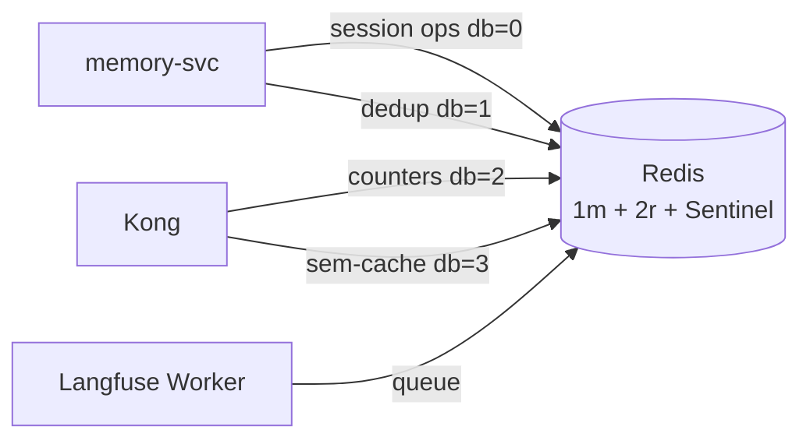

# Redis

The platform's only short-term key-value store. Single deployment, multiple logical databases.

## What it owns

| DB | Purpose |
|---|---|
| 0 | Short-term conversation memory (per-session, TTL-bounded) |
| 1 | Idempotency dedup tables for at-least-once NATS consumers |
| 2 | Kong rate-limit counters |
| 3 | Kong semantic-cache backing (embedding-keyed) |

## Why one Redis

One stack per use case. We do not run two Redis instances. The logical-database separation is sufficient for the four roles above.

Note: this is **not** the same Redis instance that backs FalkorDB. FalkorDB *is* a Redis-compatible service but it serves graph queries, not key-value workloads. The Redis described here is the standalone platform key-value store.

## Install and setup

Upstream: Bitnami Redis Helm chart.

```bash
helm repo add bitnami https://charts.bitnami.com/bitnami
helm repo update

helm upgrade --install redis bitnami/redis \
  --version 19.x.x \
  --namespace ai-platform \
  --values platform/L4-data-plane/redis/values.yaml
```

Pinned `values.yaml`:
- `architecture: replication` (1 master + 2 replicas + Sentinel)
- `master.persistence.size: 20Gi`
- `auth.enabled: true` with password from K8s Secret
- `master.configuration` enables AOF persistence

Reconciled by ArgoCD.

## Flow



## References

- Redis documentation: https://redis.io/docs/
- Bitnami Redis chart: https://github.com/bitnami/charts/tree/main/bitnami/redis
- Layer specification: `docs/layers/L4-context-and-memory/README.md`

## Status

Helm install lands at Stage 02.
