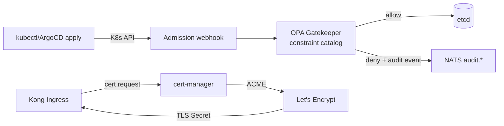

# L6 — Safety, Policy and Governance

Cross-cutting enforcement: admission validation, certificate issuance, namespace defaults.

## Contents

- `opa-gatekeeper/` — ConstraintTemplates and Constraints.
- `cert-manager/` — ClusterIssuers and per-workload Issuers.

## References

- Layer specification: `docs/layers/L6-safety-policy-governance/README.md`.
- OPA Gatekeeper docs: https://open-policy-agent.github.io/gatekeeper/website/docs/
- cert-manager docs: https://cert-manager.io/docs/
