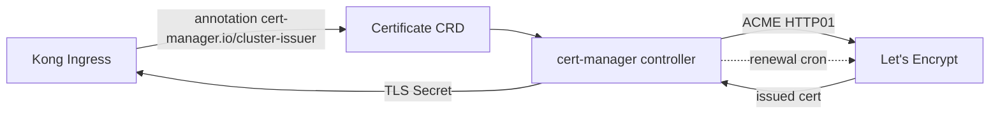

# cert-manager

The platform's only TLS certificate issuer. Issues and rotates certificates for ingresses (Kong) and any internal mTLS endpoints.

## What it owns

- ClusterIssuer for Let's Encrypt staging.
- ClusterIssuer for Let's Encrypt production (enabled in Stage 14).
- Per-workload Issuers when internal mTLS is required.
- Certificate CRDs reconciled automatically; renewal handled.

## Why one issuer

One stack per use case. We do not pair cert-manager with another TLS controller.

## Install and setup

Upstream: cert-manager Helm chart.

```bash
helm repo add jetstack https://charts.jetstack.io
helm repo update

helm upgrade --install cert-manager jetstack/cert-manager \
  --version 1.15.x \
  --namespace cert-manager \
  --create-namespace \
  --set installCRDs=true

# Then apply ClusterIssuer
kubectl apply -f platform/L6-governance/cert-manager/clusterissuers/
```

Reconciled by ArgoCD.

## Flow



## References

- cert-manager documentation: https://cert-manager.io/docs/
- cert-manager Helm chart: https://github.com/cert-manager/cert-manager/tree/master/deploy/charts/cert-manager
- Let's Encrypt: https://letsencrypt.org/
- Layer specification: `docs/layers/L6-safety-policy-governance/README.md`

## Status

Helm install lands at Stage 03 (TLS needed for Langfuse ingress).
