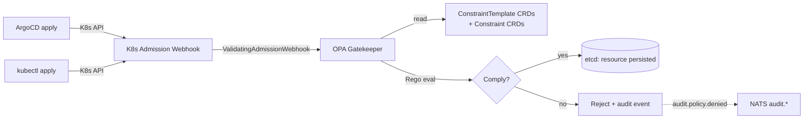

# OPA Gatekeeper

The platform's only admission-time policy enforcer. ConstraintTemplates and Constraints reject non-compliant Kubernetes resources before they are persisted to etcd.

## What it owns

| Constraint | Enforces |
|---|---|
| `RequireResourceLimits` | Every Deployment / Pod declares CPU and memory requests + limits |
| `DisallowLatestImageTag` | No `:latest` image tags |
| `DisallowPrivilegedContainers` | `securityContext.privileged: true` denied outside `cube-system` |
| `RequireCubeRuntimeClassInTools` | Pods in `tools-*` namespaces must use `runtimeClassName: cube` |
| `RequireAgentResourceBounds` | kagent `Agent` CRDs must declare `resources.requests` and `resources.limits` |
| `RequireNetworkPolicy` | Workload namespaces must have a default-deny NetworkPolicy |
| `RequireOTelInstrumentation` | Warn-only audit: workload pods missing OTel sidecar or SDK |

## Why one admission controller

One stack per use case. We do not run Kyverno alongside OPA Gatekeeper. Constraint authoring is in Rego; the team standardizes on it.

## Install and setup

Upstream: Gatekeeper Helm chart.

```bash
helm repo add gatekeeper https://open-policy-agent.github.io/gatekeeper/charts
helm repo update

helm upgrade --install gatekeeper gatekeeper/gatekeeper \
  --version 3.16.x \
  --namespace gatekeeper-system \
  --create-namespace

# Then apply ConstraintTemplates + Constraints
kubectl apply -f platform/L6-governance/opa-gatekeeper/templates/
kubectl apply -f platform/L6-governance/opa-gatekeeper/constraints/
```

Reconciled by ArgoCD.

## Flow



## References

- OPA Gatekeeper documentation: https://open-policy-agent.github.io/gatekeeper/website/docs/
- Gatekeeper Helm chart: https://github.com/open-policy-agent/gatekeeper/tree/master/charts/gatekeeper
- Rego language: https://www.openpolicyagent.org/docs/latest/policy-language/
- Layer specification: `docs/layers/L6-safety-policy-governance/README.md`

## Status

Helm install + initial constraint set land at Stage 11.
