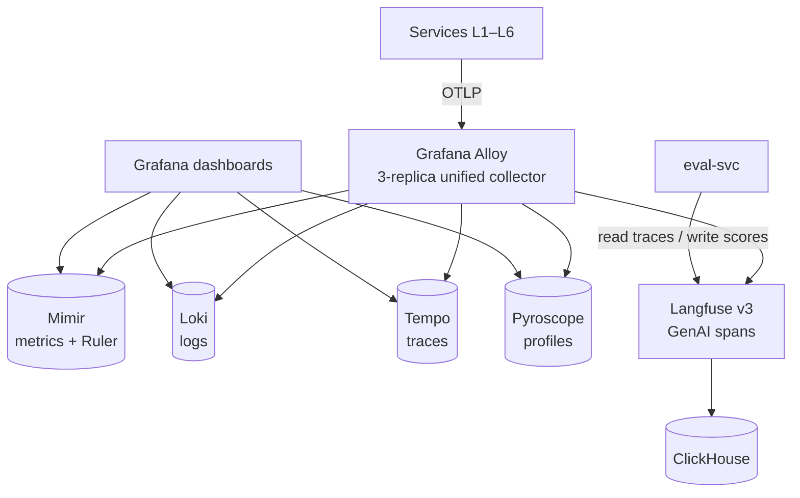

# L7 — Observability

Complete observability + evaluation stack. Per ADR-0006, the platform deploys Grafana Alloy as the *only* collector — it replaces vanilla OTel Collector, kube-prometheus-stack, Promtail, and a standalone profiling agent.

## Contents

| Folder | Role |
|---|---|
| `alloy/` | Grafana Alloy unified collector (clustered, 3-replica) |
| `mimir/` | Mimir metrics store + Mimir Ruler for alerts |
| `loki/` | Loki logs store |
| `tempo/` | Tempo traces store |
| `pyroscope/` | Pyroscope continuous-profile store |
| `langfuse/` | Langfuse v3 (Web + Worker) self-hosted |
| `grafana-dashboards/` | JSON dashboards loaded via Grafana sidecar |

## References

- Layer specification: `docs/layers/L7-observability-reliability/README.md`.
- Decision rationale: `docs/adr/0006-observability-alloy-lgtmp-langfuse.md`.
- Harness engineering doctrine: `docs/protocols/harness-engineering.md`.
- OTel GenAI semconv: `docs/protocols/otel-genai-semconv.md`.
