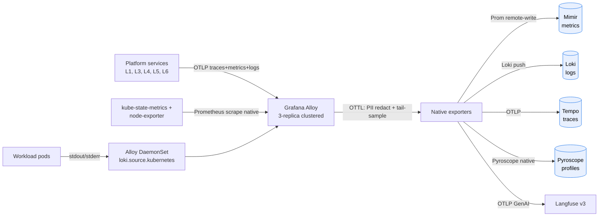

# Grafana Alloy

The platform's unified telemetry collector. One agent, one configuration syntax, one upgrade cadence. Alloy is an OpenTelemetry Collector distribution with native Prometheus + Loki + Pyroscope pipelines — it replaces vanilla OTel Collector, kube-prometheus-stack, Promtail, and a standalone profiling agent. See ADR-0006.

## Topology

- 3-replica clustered deployment in the `ai-observability` namespace.
- Combined DaemonSet (per-node container-log collection) + StatefulSet (clustered scrape-shard mode).
- Local web UI at port 12345 for live pipeline inspection.

## Pipelines

Inputs:
- OTLP gRPC / HTTP receivers on 4317 / 4318.
- Prometheus scraping via the native `prometheus.scrape` component (kube-state-metrics, node-exporter, custom workload metrics).
- Kubernetes pod logs via `loki.source.kubernetes`.
- Pyroscope profiles via `pyroscope.receive_http`.

Processors:
- PII redaction via OTTL on attributes and `gen_ai.content.*` span events.
- Tail sampling: 100% errors, 100% HITL events, 100% A2A inbound, 5% routine traces.
- Per-workload sampling overrides via attribute matchers.

Outputs:
- Mimir via `prometheus.remote_write`.
- Loki via `loki.write`.
- Tempo via OTLP exporter.
- Pyroscope via `pyroscope.write`.
- Langfuse via OTLP exporter (GenAI spans only).

## Install and setup

Upstream: Grafana Alloy Helm chart from `grafana/helm-charts`.

```bash
helm repo add grafana https://grafana.github.io/helm-charts
helm repo update

helm upgrade --install alloy grafana/alloy \
  --version 0.10.x \
  --namespace ai-observability \
  --create-namespace \
  --values platform/L7-observability/alloy/values.yaml
```

Pinned `values.yaml`:
- `controller.type: statefulset` and `controller.replicas: 3` (for clustered scrape sharding).
- `alloy.clustering.enabled: true`.
- `alloy.configMap.create: true` referencing `config.alloy` from the ConfigMap with the full pipeline declaration.
- `alloy.extraPorts` exposes 4317 (OTLP gRPC), 4318 (OTLP HTTP), 12345 (web UI).
- `serviceMonitor.enabled: true` so Alloy scrapes its own metrics into Mimir.

A separate DaemonSet release handles per-node log collection:

```bash
helm upgrade --install alloy-logs grafana/alloy \
  --version 0.10.x \
  --namespace ai-observability \
  --values platform/L7-observability/alloy/values-daemonset.yaml
```

Reconciled by ArgoCD in production.

## Flow



## References

- Grafana Alloy product page: https://grafana.com/oss/alloy-opentelemetry-collector/
- Grafana Alloy Helm chart: https://github.com/grafana/alloy/tree/main/operations/helm/charts/alloy
- Alloy clustering documentation: https://grafana.com/docs/alloy/latest/concepts/clustering/
- Alloy OTTL processor reference: https://grafana.com/docs/alloy/latest/reference/components/otelcol.processor/
- OpenTelemetry GenAI semantic conventions: `docs/protocols/otel-genai-semconv.md`
- Decision rationale: `docs/adr/0006-observability-alloy-lgtmp-langfuse.md`
- Layer specification: `docs/layers/L7-observability-reliability/README.md`

## Status

Helm install lands at Stage 03.
