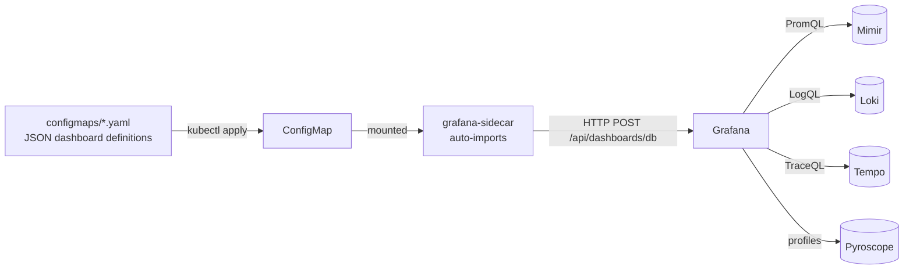

# Grafana dashboards

JSON dashboards loaded into Grafana by the sidecar via ConfigMap. The visualization plane for the ops side (Mimir, Loki, Tempo, Pyroscope).



## What lives here

| Dashboard | Source | Shows |
|---|---|---|
| `llm_latency.json` | Ported from reference workload | LLM call latency histograms by model and provider |
| `red-l1-gateway.json` | Platform-built | Request rate, errors, duration for Kong |
| `red-l3-agent-runtime.json` | Platform-built | RED for agent-orchestrator + agent-worker |
| `red-l4-memory.json` | Platform-built | RED for memory-svc, session-svc, rerank-svc |
| `red-l5-tooling.json` | Platform-built | RED for mcp-sandbox-runner |
| `heuristics.json` | Platform-built (Stage 12) | Hit-rate of every heuristic in the catalog |
| `rag-quality.json` | Platform-built (Stage 12) | RAGAS metric distributions over time |
| `kagent-controller.json` | Platform-built | Reconcile loop health, queue depth, leader election state |
| `nats-jetstream.json` | Upstream NATS dashboards | Stream/consumer health, lag |
| `cube-sandbox.json` | Platform-built | Cold-start histogram, sandbox count, egress denials |

## Install and setup

```bash
kubectl apply -f platform/L7-observability/grafana-dashboards/configmaps/
```

In production, ArgoCD reconciles the ConfigMaps. Grafana's sidecar (configured in the Grafana Helm chart) detects new ConfigMaps with the `grafana_dashboard: "1"` label and auto-imports them.

## References

- Grafana sidecar dashboard provisioning: https://github.com/grafana/helm-charts/tree/main/charts/grafana
- Grafana dashboard JSON model: https://grafana.com/docs/grafana/latest/dashboards/build-dashboards/modify-dashboard-settings/
- Heuristic engineering catalog (informs `heuristics.json`): `docs/protocols/heuristic-engineering.md`.
- RAG architecture (informs `rag-quality.json`): `docs/protocols/rag-architecture.md`.

## Status

Initial dashboards land at Stage 03. Stage-12 dashboards (heuristics, rag-quality) land with the harness.
