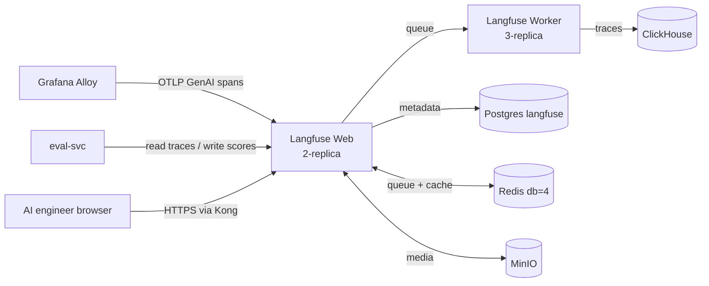

# Langfuse v3

The platform's only LLM-specific observability plane. Self-hosted Langfuse v3 receives GenAI-flavored OTLP from Grafana Alloy.

## What it owns

- Prompt traces (full request/response pairs with `gen_ai.*` attributes).
- Evaluation scores (the five online LLM-as-judge metrics from `eval-svc`, plus offline Ragas / DeepEval / Inspect AI results).
- Datasets and dataset runs.
- Prompt management (versioning and rollout).

## Why one LLM observability plane

One stack per use case. Langfuse covers the AI-engineering side; Grafana covers the SRE side. We do not pair Langfuse with another LLM-trace store.

## Install and setup

Upstream: Langfuse k8s Helm chart at https://github.com/langfuse/langfuse-k8s.

```bash
helm repo add langfuse https://langfuse.github.io/langfuse-k8s
helm repo update

helm upgrade --install langfuse langfuse/langfuse \
  --version x.y.z \
  --namespace ai-observability \
  --values platform/L7-observability/langfuse/values.yaml
```

Pinned `values.yaml`:
- `langfuseWeb.replicaCount: 2` (HA Web tier).
- `langfuseWorker.replicaCount: 3` (HA Worker tier).
- External Postgres: CNPG cluster `langfuse` (Stage 02).
- External ClickHouse: shared cluster in `ai-observability` (Stage 02).
- External Redis: shared platform Redis with own logical DB (Stage 02).
- External S3: MinIO `langfuse-media` bucket (Stage 02).
- Ingress via Kong with cert-manager-managed TLS.

Reconciled by ArgoCD.

## Flow



## References

- Langfuse self-hosting on Kubernetes: https://langfuse.com/self-hosting/deployment/kubernetes-helm
- langfuse/langfuse-k8s GitHub: https://github.com/langfuse/langfuse-k8s
- Layer specification: `docs/layers/L7-observability-reliability/README.md`

## Status

Helm install lands at Stage 03; eval-svc integration lands at Stage 12.
