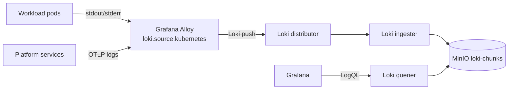

# Loki

The platform's only logs backend. Grafana Loki receives logs from Grafana Alloy via the Loki push protocol.

## What it owns

- All platform logs (container logs from every pod, plus application-emitted structured logs via OTLP).
- 14-day retention.
- Trace-to-log correlation via `trace_id` and `span_id` labels.

## Why one log store

One stack per use case. We do not run Elasticsearch or OpenSearch alongside Loki. Alloy reads container logs natively (no Promtail).

## Install and setup

Upstream: Loki distributed Helm chart.

```bash
helm repo add grafana https://grafana.github.io/helm-charts
helm repo update

helm upgrade --install loki grafana/loki-distributed \
  --version 0.79.x \
  --namespace ai-observability \
  --values platform/L7-observability/loki/values.yaml
```

Pinned `values.yaml`:
- Distributor / ingester / querier / compactor enabled.
- Object storage backend: MinIO (`loki-chunks` bucket).
- `retention_period: 336h` (14 days).

Reconciled by ArgoCD.

## Flow



## References

- Loki documentation: https://grafana.com/docs/loki/latest/
- Loki distributed Helm chart: https://github.com/grafana/loki/tree/main/production/helm/loki-distributed
- LogQL reference: https://grafana.com/docs/loki/latest/query/

## Status

Helm install lands at Stage 03.
