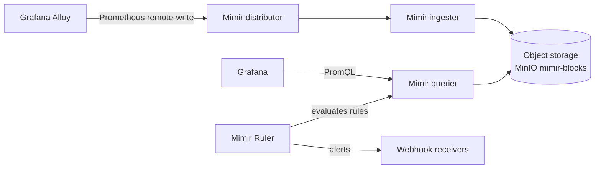

# Mimir

The platform's only metrics backend. Mimir is Grafana's distributed Prometheus-compatible TSDB. Receives Prometheus remote-write from Grafana Alloy.

## What it owns

- All platform metrics (Kong, NATS, kagent, agent services, memory services, sandbox runner, eval-svc, every kube-state metric).
- Recording rules and alert rules via **Mimir Ruler** (replaces Alertmanager-on-Prometheus, ADR-0006).
- 30-day full retention, 1-year compacted retention.

## Why one metrics store

One stack per use case. We do not run a separate Prometheus server alongside Mimir — Alloy scrapes and remote-writes directly to Mimir. Alertmanager is replaced by Mimir Ruler.

## Install and setup

Upstream: Mimir distributed Helm chart.

```bash
helm repo add grafana https://grafana.github.io/helm-charts
helm repo update

helm upgrade --install mimir grafana/mimir-distributed \
  --version 5.x.x \
  --namespace ai-observability \
  --values platform/L7-observability/mimir/values.yaml
```

Pinned `values.yaml`:
- Distributor / ingester / querier / store-gateway / compactor / ruler all enabled.
- Object storage backend: MinIO (`mimir-blocks` bucket).
- `ruler.enabled: true` with rules synced from a ConfigMap.

Reconciled by ArgoCD.

## Flow



## References

- Mimir documentation: https://grafana.com/docs/mimir/latest/
- Mimir distributed Helm chart: https://github.com/grafana/mimir/tree/main/operations/helm/charts/mimir-distributed
- Mimir Ruler: https://grafana.com/docs/mimir/latest/references/architecture/components/ruler/

## Status

Helm install lands at Stage 03.
