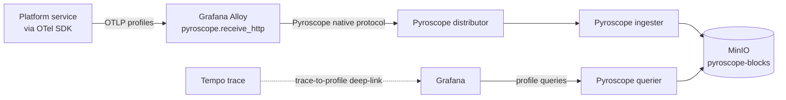

# Pyroscope

The platform's only continuous profiling backend. CPU and memory flame graphs over time, captured by Grafana Alloy from every service.

## What it owns

- CPU and memory profiles from all platform services.
- Pyroscope's native protocol receivers (via Alloy).
- Trace-to-profile correlation: from a slow trace in Tempo, deep-link to the matching profile in Pyroscope via Grafana.
- 7-day retention by default; per-workload override via a `retention` label.

## Why one profiler

One stack per use case. We do not run a separate profiling agent alongside Pyroscope; Alloy ships the receiver.

## Install and setup

Upstream: Grafana Pyroscope Helm chart.

```bash
helm repo add grafana https://grafana.github.io/helm-charts
helm repo update

helm upgrade --install pyroscope grafana/pyroscope \
  --version 1.x.x \
  --namespace ai-observability \
  --values platform/L7-observability/pyroscope/values.yaml
```

Pinned `values.yaml`:
- `pyroscope.replicaCount: 3` (HA).
- `pyroscope.persistence.size: 100Gi`.
- Object storage backend: MinIO (`pyroscope-blocks` bucket).
- `pyroscope.config.scrape_configs: []` — Alloy is the collector; Pyroscope does not scrape directly.

Services emit profiles via either the Pyroscope SDK (Python: `pyroscope-io`) or the OpenTelemetry Profiling signal. The platform standard is the OTel Profiling signal so that one SDK (OpenTelemetry) covers traces + metrics + logs + profiles.

Reconciled by ArgoCD.

## Flow



## References

- Grafana Pyroscope documentation: https://grafana.com/docs/pyroscope/latest/
- Pyroscope Helm chart: https://github.com/grafana/pyroscope/tree/main/operations/pyroscope/helm/pyroscope
- OpenTelemetry Profiling signal: https://opentelemetry.io/docs/specs/otel/profiles/
- Decision rationale: `docs/adr/0006-observability-alloy-lgtmp-langfuse.md`
- Layer specification: `docs/layers/L7-observability-reliability/README.md`

## Status

Helm install lands at Stage 03.
