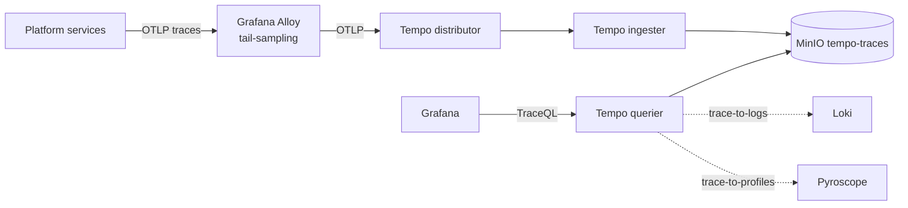

# Tempo

The platform's only distributed-tracing backend. Grafana Tempo receives OTLP traces from Grafana Alloy.

## What it owns

- All platform traces (Kong → agent-orchestrator → agent-worker → memory-svc → mcp-sandbox-runner, with GenAI semconv attributes).
- 7-day full retention; 30-day sampled retention via tail-based sampling at Alloy.
- TraceQL for searching by attributes; deep-links from Grafana to Pyroscope profiles.

## Why one trace store

One stack per use case. No Jaeger parallel.

## Install and setup

Upstream: Tempo distributed Helm chart.

```bash
helm repo add grafana https://grafana.github.io/helm-charts
helm repo update

helm upgrade --install tempo grafana/tempo-distributed \
  --version 1.21.x \
  --namespace ai-observability \
  --values platform/L7-observability/tempo/values.yaml
```

Pinned `values.yaml`:
- Distributor / ingester / querier / compactor enabled.
- Object storage backend: MinIO (`tempo-traces` bucket).
- `retention: 168h` (7 days full).

Reconciled by ArgoCD.

## Flow



## References

- Tempo documentation: https://grafana.com/docs/tempo/latest/
- Tempo distributed Helm chart: https://github.com/grafana/helm-charts/tree/main/charts/tempo-distributed
- TraceQL: https://grafana.com/docs/tempo/latest/traceql/

## Status

Helm install lands at Stage 03.
