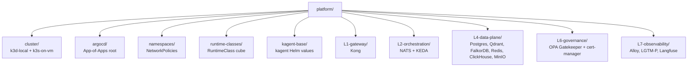

# platform/

Infrastructure-as-code for the entire platform. Helm charts, Kustomize overlays, and ArgoCD `Application` manifests. Code that *runs* on the cluster lives in `services/`; this directory *provisions* the cluster itself and the platform services.

## Subdirectory map

The five layer directories (`L1`, `L2`, `L4`, `L6`, `L7`) correspond directly to the seven-layer model. L3 and L5 do not have a `platform/` directory because they are application services (in `services/`), not platform infrastructure. The cluster-provisioning trio (`cluster`, `argocd`, `runtime-classes`, `namespaces`) plus the kagent base (`kagent-base`) are foundational and orthogonal to the layer numbering.

## Folder discipline

Every subdirectory has:

- `README.md` explaining the component, with an install/setup section pinned to upstream charts.
- `FLOW.mmd` or an embedded Mermaid diagram showing data flow.
- `runbook.md` when the component has operational procedures distinct from the layer-level runbook.

## References

- Layer specifications: `docs/layers/L1..L7-*/README.md`.
- Architecture decision records: `docs/adr/`.
- Cross-cutting doctrines: `docs/protocols/`.
- Implementation stages: `docs/stages/STAGE-NN-*/README.md`.
